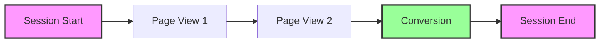
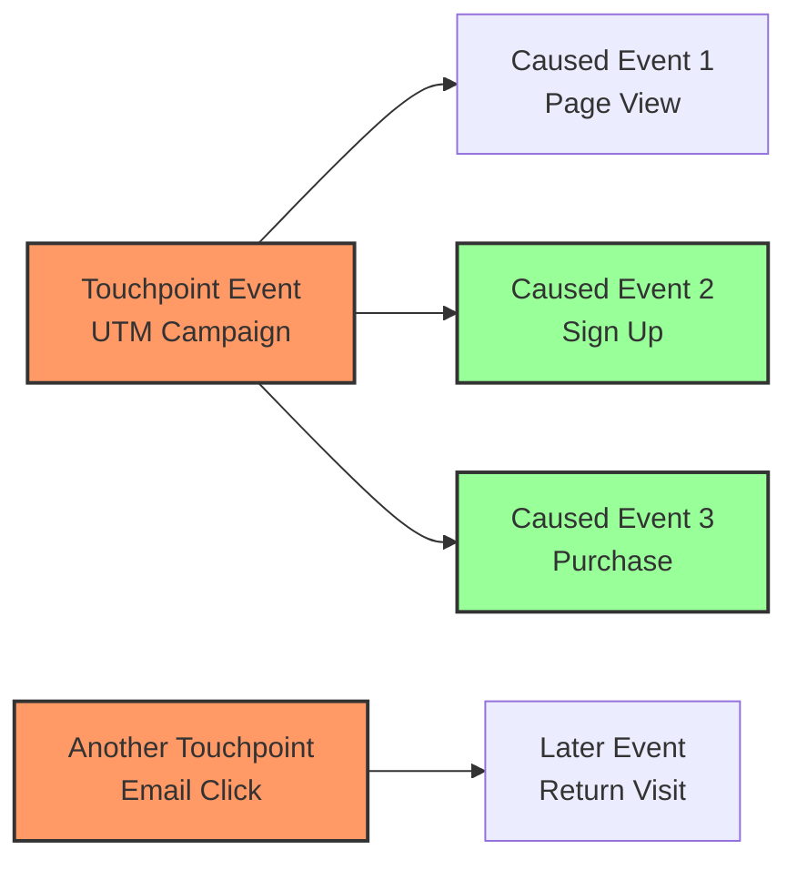
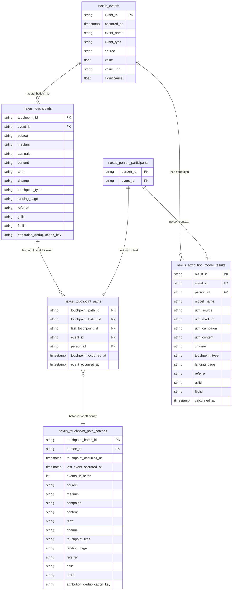

# Attribution in Nexus

Nexus implements a fundamentally different approach to attribution modeling that
focuses on **causal event relationships** rather than traditional session-based
attribution. This document explains the conceptual framework and how it differs
from conventional analytics approaches.

---

## Core Concept: Event-Driven Attribution

### Traditional Session-Based Attribution

Most analytics platforms use **session-based attribution**:



**Limitations:**

- **Arbitrary time boundaries** (30-minute session timeouts)
- **Single touchpoint per session** (first or last)
- **No cross-session attribution** (user returns later)
- **Session-centric thinking** rather than user journey focus

### Nexus Event-Driven Attribution

Nexus focuses on **causal relationships between specific events**:



**Advantages:**

- **Event-to-event causality** (which specific event influenced which other
  events)
- **Cross-session attribution** (touchpoints influence events days/weeks later)
- **Cross-source attribution** (Google Analytics touchpoints → Shopify
  conversions)
- **Bidirectional online/offline** (direct mail touchpoints → website
  conversions, or digital touchpoints → phone sales)
- **Multiple attribution models** (first touch, last touch, multi-touch)
- **Person-centric journeys** rather than session boundaries

---

## How Nexus Attribution Works

### 1. Touchpoint Identification

**Touchpoints** are events that contain attribution information:

- **UTM parameters** (utm_source, utm_medium, utm_campaign)
- **Referrer information** (social media, search engines)
- **Campaign identifiers** (gclid, fbclid)
- **Landing page context** (entry points with attribution data)

```sql
-- Example: Event becomes a touchpoint if it has attribution data
SELECT
  event_id,
  utm_source,
  utm_medium,
  utm_campaign,
  referrer
FROM nexus_events
WHERE utm_source IS NOT NULL
   OR referrer IS NOT NULL
   OR gclid IS NOT NULL
```

### 2. Causal Event Relationships

Nexus creates **direct causal links** between touchpoints and subsequent events:

- **Temporal logic**: Touchpoint must occur BEFORE the attributed event
- **Person context**: Attribution only within the same person's journey
- **Latest touchpoint wins**: Most recent touchpoint gets credit for each event
- **90-day attribution window**: Prevents extremely old touchpoints from
  attributing

### 3. Attribution Path Creation

The system builds **attribution paths** that show which touchpoint influenced
each event:

```sql
-- Conceptual attribution path
touchpoint_id: tch_abc123 (UTM: google/cpc/brand-campaign)
    ↓ influences
event_id: evt_def456 (Sign Up)
event_id: evt_ghi789 (Purchase)
event_id: evt_jkl012 (Return Visit)
```

---

## Database Schema

The Nexus attribution system uses a clean, normalized schema designed for
efficiency and flexibility:



---

## Key Differences from Traditional Attribution

### Session-Based vs Event-Based

| Aspect                       | Traditional (Session-Based)  | Nexus (Event-Based)             |
| ---------------------------- | ---------------------------- | ------------------------------- |
| **Attribution Unit**         | Sessions (time-bounded)      | Individual Events               |
| **Attribution Logic**        | First/last touch per session | Latest touchpoint per event     |
| **Cross-Visit Attribution**  | Limited or none              | Full cross-visit tracking       |
| **Cross-Source Attribution** | Single platform only         | Multiple data sources unified   |
| **Offline Integration**      | Not supported                | Full online/offline attribution |
| **Attribution Window**       | Session timeout (30 min)     | Configurable (90 days)          |
| **Granularity**              | Session-level                | Event-level                     |
| **User Journey View**        | Fragmented by sessions       | Complete person journey         |

### Real-World Examples

#### Example 1: Cross-Source E-commerce Attribution

**Scenario**: Attributing Shopify orders to Google Analytics website touchpoints

**Traditional Approach** (siloed):

```
Google Analytics: [Paid Search Click] → [Product Page View] → [Cart Add]
Shopify: [Order Placed] (no connection to GA data)
Result: Cannot attribute Shopify revenue to Google Ads spend
```

**Nexus Approach** (unified):

```
Event 1: [Google Ad Click] (GA source) → Creates touchpoint
Event 2: [Product Page View] (GA source) → Attributed to Google Ad
Event 3: [Cart Add] (GA source) → Attributed to Google Ad
Event 4: [Order Placed] (Shopify source) → Attributed to Google Ad touchpoint
Result: $500 Shopify order attributed to $2.50 Google Ad click = 200x ROAS
```

#### Example 2: Online-to-Offline Attribution

**Scenario**: Attributing sales calls and direct mail to digital touchpoints

**Traditional Approach** (disconnected):

```
Website: [Blog Post Read] → [Whitepaper Download]
CRM: [Sales Call Scheduled] (no attribution context)
Direct Mail: [Catalog Sent] (separate campaign tracking)
Result: Cannot connect digital engagement to offline conversions
```

**Nexus Approach** (bidirectional):

```
Event 1: [LinkedIn Ad Click] (digital source) → Creates touchpoint
Event 2: [Blog Post Read] (website source) → Attributed to LinkedIn Ad
Event 3: [Whitepaper Download] (website source) → Attributed to LinkedIn Ad
Event 4: [Sales Call Scheduled] (CRM source) → Attributed to LinkedIn Ad
Event 5: [Direct Mail Sent] (offline source) → Creates NEW touchpoint
Event 6: [Purchase] (CRM source) → Attributed to Direct Mail touchpoint
Result: Complete attribution across digital → offline → conversion funnel
```

#### Example 3: Offline-to-Online Attribution

**Scenario**: Direct mail campaigns driving online conversions

**Nexus Implementation:**

```
Event 1: [Direct Mail Sent] (offline source) → Creates touchpoint
Event 2: [Website Visit] (GA source) → Attributed to Direct Mail
Event 3: [Product Search] (GA source) → Attributed to Direct Mail
Event 4: [Online Purchase] (Shopify source) → Attributed to Direct Mail
Result: Online revenue attributed to offline marketing spend
```

### Benefits of Event-Driven Approach

1. **True User Journey Tracking**: Maintains attribution context across multiple
   visits
2. **Flexible Attribution Windows**: Not constrained by arbitrary session
   timeouts
3. **Event-Level Granularity**: Can attribute specific actions to specific
   touchpoints
4. **Multiple Attribution Models**: Supports first-touch, last-touch, and
   multi-touch within same framework
5. **Cross-Source Attribution**: Unifies attribution across completely different
   data sources (web analytics + CRM + offline events)
6. **Bidirectional Attribution**: Both online and offline events can serve as
   touchpoints OR conversion events

---

## Attribution Models Supported

### Last Touch Attribution (Current Implementation)

- **Logic**: Each event gets attributed to its most recent prior touchpoint
- **Use Case**: Understanding immediate conversion drivers
- **Implementation**: `nexus_touchpoint_paths` provides latest touchpoint per
  event

### First Touch Attribution

- **Logic**: All events for a person get attributed to their first touchpoint
- **Use Case**: Understanding initial awareness drivers
- **Implementation**: Query `nexus_touchpoint_path_batches` for earliest
  touchpoint per person

### Multi-Touch Attribution

- **Logic**: Credit distributed across multiple touchpoints in user journey
- **Use Case**: Understanding full funnel contribution
- **Implementation**: Use batch data to apply weighted attribution across
  touchpoint sequences

### Time-Decay Attribution

- **Logic**: More recent touchpoints receive higher attribution weight
- **Use Case**: Balancing recency with multi-touch insights
- **Implementation**: Apply decay functions based on time gaps in touchpoint
  paths

---

## Performance and Scale

### Optimized for Large Datasets

The Nexus attribution system is designed to handle enterprise-scale data
efficiently:

- **95.4% reduction** in processing overhead (155M → 7.1M rows)
- **90-day attribution window** prevents runaway cross-joins
- **Batch processing** enables efficient attribution model computation
- **Materialized tables** provide fast lookups without recomputation

### Attribution Coverage

In typical implementations:

- **67.6%** of events receive touchpoint attribution
- **32.4%** remain unattributed (direct traffic, pre-touchpoint events)
- **5.6:1 compression ratio** through intelligent batching

### Real-World Performance

- **Processing 10.5M events** → **7.1M attribution relationships**
- **1.3M batches** with complete attribution metadata for efficient model
  processing
- **Automatic schema evolution** when new attribution sources are added
- **Sub-minute execution** times for attribution model updates

---

## Conceptual Advantages

### 1. **Cross-Source Attribution**

**Break Down Data Silos:** Nexus unifies attribution across completely different
data sources, enabling true cross-platform ROI measurement:

- **Google Analytics website data** → **Shopify order data**
- **Facebook ad clicks** → **Salesforce lead conversions**
- **Email campaign opens** → **In-store purchase data**
- **Direct mail sends** → **Website conversion events**

### 2. **Bidirectional Online/Offline Attribution**

**Offline Events as Touchpoints:**

- **Direct mail campaigns** → Influence online website behavior
- **Sales rep phone calls** → Drive future digital engagement
- **Trade show booth visits** → Create touchpoints for later conversions
- **Print advertising** → Generate touchpoints that influence online purchases

**Offline Events as Conversions:**

- **In-store purchases** → Attributed to digital marketing touchpoints
- **Phone sales** → Attributed to website content touchpoints
- **Contract signings** → Attributed to webinar or content marketing touchpoints

### 3. **Person-Centric Attribution**

Unlike session-based systems that fragment user journeys, Nexus maintains
complete attribution context across all touchpoints and events for each person,
regardless of data source or online/offline channel.

### 4. **Flexible Attribution Windows**

Configure attribution windows based on your business needs (90 days default)
rather than being constrained by session timeouts, enabling long sales cycle
attribution across multiple data sources.

### 5. **Event Causality**

Understand exactly which marketing touchpoint (from any source) influenced which
specific business outcome (in any other source), enabling precise cross-platform
ROI calculation.

### 6. **Multiple Model Support**

Run different attribution models simultaneously on the same underlying unified
data, comparing first-touch vs last-touch vs multi-touch insights across all
your integrated sources and channels.

---

## Cross-Source Attribution in Practice

### Unified Data Sources

Nexus attribution works seamlessly across any combination of data sources:

**Digital Sources:**

- **Web Analytics**: Google Analytics, Adobe Analytics, Segment
- **Advertising**: Google Ads, Facebook Ads, LinkedIn Ads, TikTok Ads
- **Email Marketing**: Mailchimp, Klaviyo, SendGrid, Constant Contact
- **Social Media**: Facebook, Instagram, Twitter, LinkedIn organic posts
- **Content**: Blog platforms, YouTube, podcast platforms

**Business Systems:**

- **E-commerce**: Shopify, WooCommerce, Magento, BigCommerce
- **CRM**: Salesforce, HubSpot, Pipedrive, Zoho
- **Customer Support**: Zendesk, Intercom, Freshdesk
- **Payment Processing**: Stripe, PayPal, Square

**Offline Channels:**

- **Direct Mail**: Campaign sends, postal tracking, response codes
- **Phone/SMS**: Call logs, text message campaigns, sales conversations
- **Events**: Trade shows, conferences, webinars, in-person meetings
- **Print/Radio/TV**: Traditional media with tracking codes or surveys

### Real-World Attribution Scenarios

**B2B SaaS Example:**

```
LinkedIn Ad (touchpoint) → Blog Post Read (website) → Webinar Registration (marketing automation)
→ Sales Call (CRM) → Demo Scheduled (CRM) → Contract Signed (CRM)

Result: $50,000 annual contract attributed to $12 LinkedIn ad spend
```

**E-commerce Example:**

```
Facebook Ad (touchpoint) → Product Page View (GA) → Email Signup (email platform)
→ Abandoned Cart Email (email platform) → Return Visit (GA) → Purchase (Shopify)

Result: $200 Shopify order attributed to Facebook ad + email nurture sequence
```

**Offline-to-Online Example:**

```
Direct Mail Postcard (offline touchpoint) → Website Visit (GA)
→ Account Creation (website) → Mobile App Download (app analytics) → In-App Purchase (app)

Result: Digital conversion attributed to offline direct mail campaign
```

### Implementation Benefits

**For Marketing Teams:**

- **True ROI measurement** across all channels and platforms
- **Budget optimization** based on actual cross-source performance
- **Customer journey insights** spanning months and multiple touchpoints

**For Data Teams:**

- **Single source of truth** for attribution across all business systems
- **Consistent methodology** regardless of data source or channel type
- **Scalable architecture** that grows with new data sources

**For Business Leaders:**

- **Complete funnel visibility** from first touch to final conversion
- **Cross-channel insights** for strategic marketing decisions
- **Unified reporting** that reflects true customer behavior

---

## Next Steps

To implement attribution models on top of this foundation:

1. **Query `nexus_touchpoint_paths`** for event-level attribution
2. **Query `nexus_touchpoint_path_batches`** for efficient batch processing
3. **Store results in `nexus_attribution_model_results`** for fast lookups
4. **Build dashboards** using the attribution results for marketing insights

The Nexus attribution framework provides the foundation for sophisticated,
accurate attribution modeling that reflects real user behavior rather than
artificial session boundaries.
