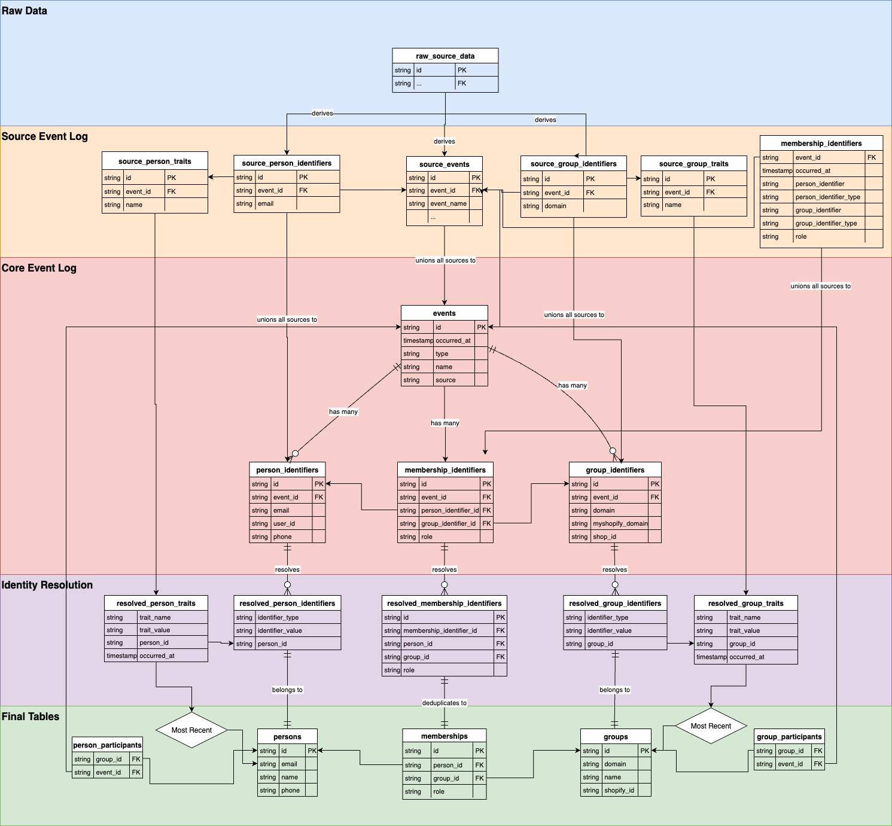
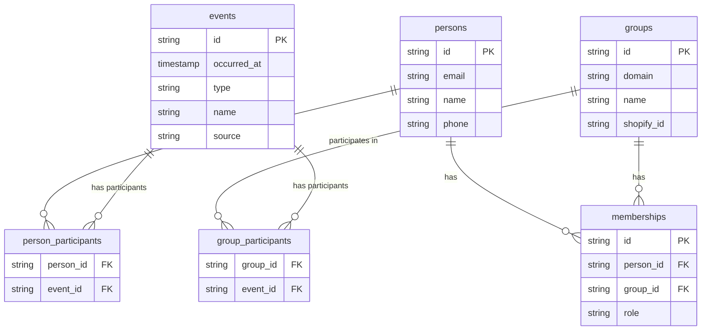
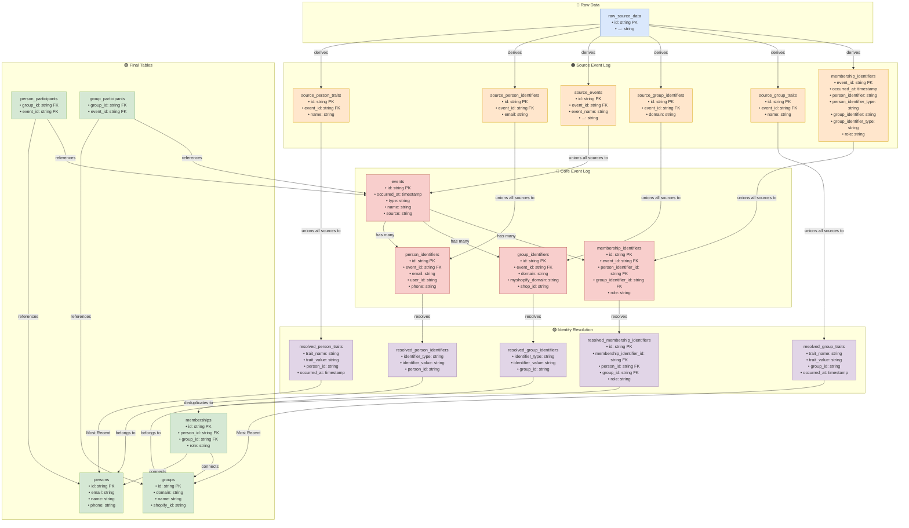

# dbt-nexus Documentation

Welcome to the **dbt-nexus** package documentation! This package provides a
standardized, source-agnostic solution for building unified customer data
platforms with powerful identity resolution and state management capabilities.

## What is dbt-nexus?

dbt-nexus is a way of structuring all company data in your data warehouse so
it's **operationally** useful, not just good for dashboards. It's designed to
help you actually close sales, speed up customer support, and reduce churn.

Specifically, it's a dbt package that lets data engineers quickly merge and
organize **any** data source into a combined view of **people**, **companies**,
and **events** - creating a complete timeline of everything you know about your
customers.

dbt-nexus helps you:

- **🔗 Resolve identities** across multiple data sources and systems
- **📊 Track events** with standardized event logging that creates actionable
  timelines
- **👥 Manage entities** including persons, groups, and their relationships
- **🏷️ Handle states** with timeline-based state management
- **⚡ Scale efficiently** with incremental processing and optimized queries
- **🎯 Drive operations** - support teams, sales teams, and AI tools get
  complete customer context

## Quick Start

Get up and running with dbt-nexus in minutes:

```yaml
# packages.yml
packages:
  - local: path/to/dbt-nexus
```

```bash
dbt deps
```

[→ Follow the complete installation guide](getting-started/installation.md)

## Architecture Overview

### Image



### Mermaid

#### Final Tables



#### Full



_Interactive database schema diagram showing the dbt-nexus data model structure
with the five-layer architecture: Raw Data, Source Event Log, Core Event Log,
Identity Resolution, and Final Tables._

> **Note**: To view the original diagram, open
> `docs/images/database-diagram.xml` in
> [diagrams.net](https://app.diagrams.net).
