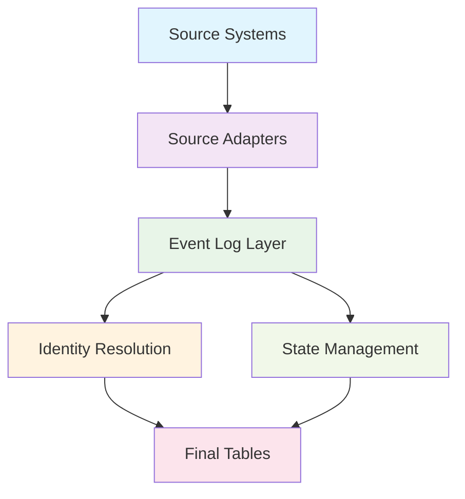

# dbt-nexus Documentation

Welcome to the **dbt-nexus** package documentation! This package provides a
standardized, source-agnostic solution for building unified customer data
platforms with powerful identity resolution and state management capabilities.

## What is dbt-nexus?

dbt-nexus is a way of structuring all company data in your data warehouse so
it's **operationally** useful, not just good for dashboards. It's designed to
help you actually close sales, speed up customer support, and reduce churn.

Specifically, it's a dbt package that lets data engineers quickly merge and
organize **any** data source into a combined view of **people**, **companies**,
and **events** - creating a complete timeline of everything you know about your
customers.

dbt-nexus helps you:

- **🔗 Resolve identities** across multiple data sources and systems
- **📊 Track events** with standardized event logging that creates actionable
  timelines
- **👥 Manage entities** including persons, groups, and their relationships
- **🏷️ Handle states** with timeline-based state management
- **⚡ Scale efficiently** with incremental processing and optimized queries
- **🎯 Drive operations** - support teams, sales teams, and AI tools get
  complete customer context

## Quick Start

Get up and running with dbt-nexus in minutes:

```yaml
# packages.yml
packages:
  - local: path/to/dbt-nexus
```

```bash
dbt deps
```

[→ Follow the complete installation guide](getting-started/installation.md)

## Core Features

### 🔍 Identity Resolution

Automatically resolve and deduplicate entities across data sources using
configurable matching rules and recursive algorithms.

### 📋 Event Logging

Standardized event, identifier, and trait tracking with batch processing
workflows.

### 🏷️ State Management

Timeline-based state tracking with derived state capabilities for complex
business logic.

### 🔧 Source Agnostic

Connect any data source through a simple adapter interface - no vendor lock-in.

## Architecture Overview



The package follows a layered architecture:

1. **Source Adapters**: Transform your data into standardized formats
2. **Event Log Layer**: Core event, identifier, and trait models
3. **Identity Resolution**: Advanced algorithms for entity deduplication
4. **State Management**: Timeline-based state tracking and derived states
5. **Final Tables**: Production-ready, resolved entity tables

## Navigation Guide

This documentation follows the [Diátaxis](https://diataxis.fr/) framework:

| Section                           | Purpose                 | When to Use                       |
| --------------------------------- | ----------------------- | --------------------------------- |
| **[Tutorials](tutorials/)**       | Learn by doing          | You're new to dbt-nexus           |
| **[How-to Guides](how-to/)**      | Solve specific problems | You need to accomplish a task     |
| **[Reference](reference/)**       | Look up details         | You need technical specifications |
| **[Explanations](explanations/)** | Understand concepts     | You want to learn how it works    |

## Real-World Applications

See how dbt-nexus enables operational data use beyond just dashboards:

- **Timeline Apps**: Get complete customer context for support and sales teams
- **Daily Updates**: Automated summaries of key events across your business
- **Email Marketing**: Always up-to-date customer lists and segmentation
- **AI Integration**: Power AI tools with complete customer context
- **Abandon Setup Notifications**: Automated outreach for incomplete onboarding

Read the full story:
[**Dbt-Nexus - Data Beyond Dashboards**](https://www.slideruleanalytics.com/blog/dbt-nexus-data-beyond-dashboards)

## Community & Support

- 📖 **Documentation**: You're here!
- 📝 **Blog**:
  [SlideRule Analytics Blog](https://www.slideruleanalytics.com/blog/)
- 🐛 **Issues**: [GitHub Issues](https://github.com/sliderule/dbt-nexus/issues)
- 💬 **Discussions**:
  [GitHub Discussions](https://github.com/sliderule/dbt-nexus/discussions)
- 📧 **Contact**:
  [hello@slideruleanalytics.com](mailto:hello@slideruleanalytics.com)

## License

This project is licensed under the
[MIT License](https://github.com/your-organization/dbt-nexus/blob/main/LICENSE).

---

**Ready to get started?** Check out our
[Quick Start Guide](getting-started/quick-start.md) or dive into the
[tutorials](tutorials/).
