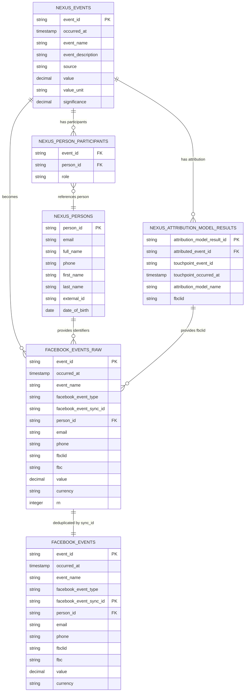

# Facebook Events Integration: Snowflake to Facebook CAPI

This document describes the complete data flow from source systems through
Snowflake to Facebook Conversions API (CAPI) for enhanced tracking and
conversion optimization.

## Overview

The Facebook Events integration captures conversion events from your source
systems, enriches them with customer data from your CRM and analytics platforms,
and sends them to Facebook CAPI for conversion tracking and optimization. This
enables precise attribution and improved Facebook ad performance through
server-side tracking and enhanced data matching.

## Facebook Events Table (`facebook_events.sql`)

### Purpose

The `facebook_events` table is a dbt model that consolidates conversion events
from multiple sources and prepares them for Facebook CAPI integration. It serves
as the central hub for all Facebook pixel tracking data.

### Events Captured

The model can capture any conversion events from your source systems. Common
examples include:

- **Purchase/Order Completed**: When a customer completes a purchase
- **Lead Generated**: When a potential customer submits a form or shows interest
- **Appointment Scheduled**: When a customer books an appointment
- **Sign Up/Registration**: When a user creates an account
- **Custom Events**: Any business-specific conversion events you define

The specific events are configured in the `facebook_events.sql` model by
filtering the `nexus_events` table for your desired event names.

### Data Sources

The Facebook Events model integrates data from the Nexus system:

1. **Nexus Events**: Conversion events from your business systems
2. **Nexus Persons**: Customer contact information and identifiers (email,
   phone, etc.)
3. **Attribution Models**: Facebook click ID (fbclid) attribution data from the
   [last_fbclid](../attribution/models/last_fbclid.md) model

### Dependencies

This model depends on the
[last_fbclid attribution model](../attribution/models/last_fbclid.md) to provide
Facebook click ID attribution data. The `last_fbclid` model tracks the most
recent Facebook click ID for each person across their touchpoint journey,
enabling proper attribution of conversions back to Facebook ad interactions.

### Key Features

- **Identity Resolution**: Leverages Nexus identity resolution to link customer
  data across systems
- **Facebook Click ID (fbclid) Attribution**: Connects conversions back to
  Facebook ad clicks using attribution models
- **Data Enrichment**: Combines event data with customer identifiers for
  enhanced Facebook matching
- **Multiple Person Support**: Handles multiple persons per event with unique
  sync IDs
- **Duplicate Prevention**: Deduplicates records to prevent sending duplicate
  conversions to Facebook

### Table Structure

The table includes:

- **Event Information**: Event ID, name, timestamp, value, source
- **Customer Data**: Person ID, email, name, phone, external IDs from Nexus
  persons
- **Attribution Data**: Facebook click ID (fbclid) from attribution models
- **Facebook-Specific Fields**: Event type mapping, content type, currency
- **Sync Management**: Unique sync IDs for handling multiple persons per event

## Data Integration Flow

The Facebook Events table can be integrated with various data platforms. Here's
an example workflow:

### 1. Key Data Sources

- **Conversions** - pull conversion events from your actual system of record for
  conversions and integrate them with dbt-nexus's event log. Filters for the
  events you want to send to facebook.
- **Identity Resolution** - provide as much identity resolution information from
  all as possible to dbt-nexus for accurate person attribution info. You don't
  have to send these identifying traits (email, phone, etc) to facebook for them
  to be valuable.
- **Attribution Tracking** - to record and send fbclid data to facebook with
  your conversion events, you need a data source that tracking pageviews, etc.
  This could be Segment, Snowplow, Google Analyitics 4 with a Big Query
  row-level export or others.

### Data Transformation

- **User Data**: Hashed emails, phone numbers, external IDs if relevant
- **Event Data**: Standard Facebook event names and custom data
- **Attribution**: Facebook click IDs and browser parameters
- **Custom Properties**: Customer information, event values

## Multiple Persons Per Event

### Facebook Event Sync ID

The model handles multiple persons per event through a unique sync identifier:

```sql
{{ nexus.create_nexus_id('facebook_event_sync', ['event_id', 'person_id']) }} as facebook_event_sync_id
```

### Use Cases

- **Multiple Guests**: When an event has multiple participants (e.g., family
  bookings)
- **Group Events**: When multiple people are involved in the same conversion
  event
- **Attribution Tracking**: Each person gets their own Facebook event with
  proper attribution

### Benefits

- **Deduplication**: Prevents duplicate Facebook events for the same
  person-event combination
- **Attribution Accuracy**: Each person gets proper Facebook attribution
- **Sync Management**: Enables tracking of which events have been synced to
  Facebook
- **Error Handling**: Helps identify and resolve sync issues

## Duplicate Prevention and Testing

### Multiple Roles Issue

**Critical Issue**: The same person can have multiple roles for the same event
(e.g., both 'customer' and 'booker'), which would create duplicate
`facebook_event_sync_id` values and send duplicate conversions to Facebook.

### Deduplication Logic

The model implements deduplication to prevent duplicate Facebook conversions:

```sql
-- Add row number for deduplication
row_number() over (partition by facebook_event_sync_id order by occurred_at) as rn

-- Keep only first occurrence
where rn = 1
```

### Required Testing

**MUST WRITE THIS TEST**: You must include a uniqueness test for
`facebook_event_sync_id` to ensure no duplicate conversions are sent to
Facebook:

```yaml
models:
  - name: facebook_events
    columns:
      - name: facebook_event_sync_id
        tests:
          - not_null
          - unique # CRITICAL: Prevents duplicate Facebook conversions
```

### Why This Test Is Critical

- **Facebook API Limits**: Duplicate conversions can trigger rate limiting
- **Attribution Accuracy**: Duplicate events skew Facebook's optimization
  algorithms
- **Cost Impact**: Duplicate conversions can inflate Facebook ad costs
- **Data Quality**: Ensures clean, reliable conversion tracking

### Deduplication Strategy

1. **Partition By**: Groups records by `facebook_event_sync_id` (same
   person-event combination)
2. **Order By**: Orders by `occurred_at` for consistent first occurrence
   selection
3. **Row Number**: Assigns `1` to first occurrence, `2` to second, etc.
4. **Filter**: `WHERE rn = 1` keeps only the earliest occurrence

## Facebook ClickID Formatting (fbc Parameter)

### Format Specification

The `fbc` parameter follows Facebook's ClickID formatting requirements as
specified in the
[Facebook Conversions API documentation](http://developers.facebook.com/docs/marketing-api/conversions-api/parameters/fbp-and-fbc/):

```
fb.1.timestamp.fbclid
```

Where:

- **`fb`**: Version prefix (always "fb")
- **`1`**: Subdomain index (1 for most domains)
- **`timestamp`**: UNIX timestamp in milliseconds when fbclid was first observed
- **`fbclid`**: The actual Facebook click ID value

### Implementation

```sql
case
    when fbclid is not null and fbclid_occurred_at is not null then
        'fb.1.' ||
        cast(extract(epoch from fbclid_occurred_at) * 1000 as bigint) ||
        '.' ||
        fbclid
    else null
end as fbc
```

### Example Output

```
fb.1.1554763741205.AbCdEfGhIjKlMnOpQrStUvWxYz1234567890
```

### When to Use fbc

- **Use `fbc`**: When you have access to the timestamp when the fbclid was first
  observed and can format it according to Facebook's specification

### Benefits

- **Enhanced Attribution**: Provides Facebook with precise click timing
- **Cross-Device Tracking**: Enables better user journey tracking
- **Optimization**: Improves Facebook's algorithm performance
- **Compliance**: Meets Facebook's CAPI requirements

## Benefits

### For Marketing

- **Precise Attribution**: Links conversions directly to Facebook ad
  interactions
- **Enhanced Optimization**: Provides rich customer data for Facebook's
  algorithm
- **Cross-Device Tracking**: Tracks users across devices and sessions
- **Privacy-Compliant**: Remove any and all sensetive data in the final table.
  You're confident that you're not sharing sensetive data with Facebook.

### Customization

The model can be customized for your specific needs:

- **Event Filtering**: Modify the `where` clause in `target_events` CTE to
  include your events
- **Event Mapping**: Update the `facebook_event_type` and
  `facebook_content_type` case statements

## How To Join Nexus Data for Facebook

To create a Facebook CAPI-ready dataset, you need to join conversion events with
customer identifiers and attribution data. Here's how to structure the joins:

### Data Relationships

The Facebook Events model joins data from three key Nexus tables:

1. **Events** → **Person Participants** → **Persons** (for customer identifiers)
2. **Events** → **Attribution Model Results** (for Facebook click IDs)
3. **Events** (for conversion event details)

### Sample Join Statement

```sql
with target_events as (
    select
        e.event_id,
        e.occurred_at,
        e.event_name,
        e.event_description,
        e.source,
        e.value,
        e.value_unit
    from {{ ref('nexus_events') }} e
    where e.event_name in ('purchase completed', 'lead generated', 'sign up')
      and e.source = 'your_source_system'
),

event_participants as (
    select
        te.*,
        pp.person_id,
        pp.role as person_role
    from target_events te
    left join {{ ref('nexus_person_participants') }} pp
        on te.event_id = pp.event_id
    where pp.role = 'customer'  -- or your customer role
),

facebook_events as (
    select
        ep.event_id,
        ep.occurred_at,
        ep.event_name,
        ep.event_description,
        ep.source,
        ep.value,
        ep.value_unit,

        -- Person information for Facebook matching
        ep.person_id, -- Good non-pII identifier
        -- All PII is optional
        p.email,
        p.full_name,
        p.phone,
        p.first_name,
        p.last_name,
        p.external_id,
        p.date_of_birth,

        -- Attribution data (fbclid)
        amr.fbclid,
        amr.touchpoint_occurred_at as fbclid_occurred_at,
        amr.attribution_model_name,

        -- Facebook event mapping
        case
            when ep.event_name = 'purchase completed' then 'Purchase'
            when ep.event_name = 'lead generated' then 'Lead'
            when ep.event_name = 'sign up' then 'CompleteRegistration'
            else 'Other'
        end as facebook_event_type,

        'USD' as currency,
        current_timestamp() as processed_at

    from event_participants ep
    left join {{ ref('nexus_persons') }} p
        on ep.person_id = p.person_id
    left join {{ ref('nexus_attribution_model_results') }} amr
        on ep.event_id = amr.attributed_event_id
        and amr.attribution_model_name = 'last_fbclid'
    where ep.person_id is not null  -- Only events with customer attribution
)

select * from facebook_events
order by occurred_at desc
```

### Data Flow ERD



### Key Join Logic

1. **Event Filtering**: Start with your target conversion events from
   `nexus_events` (filter by `significance >= 100` for marketing relevance)
2. **Customer Attribution**: Join through `nexus_person_participants` to get
   customer relationships
3. **Customer Data**: Join `nexus_persons` to get email, phone, and other
   identifiers
4. **Attribution Data**: Join `nexus_attribution_model_results` to get Facebook
   click IDs (fbclid)
5. **Facebook Mapping**: Transform event names to Facebook standard events
6. **Sync ID Generation**: Create unique `facebook_event_sync_id` for each
   person-event combination
7. **Deduplication**: Use `row_number()` to identify and remove duplicate sync
   IDs
8. **Final Output**: Keep only first occurrence (`rn = 1`) to prevent duplicate
   Facebook conversions

### Required Data Quality

- **Email or Phone**: At least one identifier for Facebook matching
- **Valid fbclid**: Facebook click ID for attribution (optional but recommended)
- **Event Values**: Monetary values for purchase events
- **Timestamps**: Accurate event timing for attribution windows

## Sending Results to Facebook CAPI

There are a number of ways to send data to Facebook CAPI. Common providers are:

- Segment Reverse ETL
- Census Data

But really any reverse ETL platform should be able to handle it.
