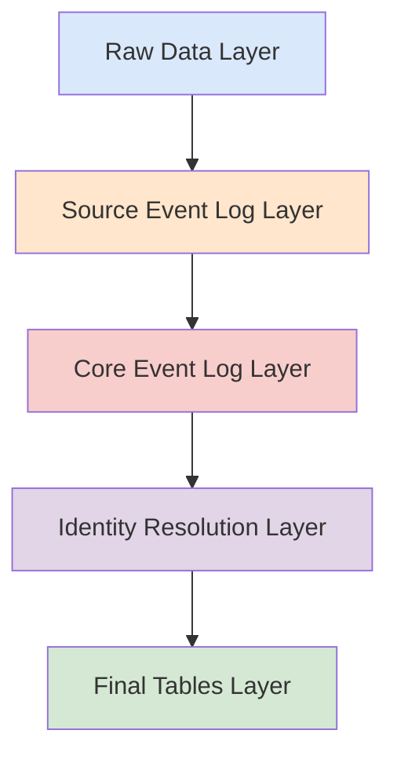

# Package Architecture

dbt-nexus follows a layered architecture designed for scalability,
maintainability, and source-agnostic data processing. This document explains the
core architectural concepts and data flow.

## Architectural Overview

The package is organized into **five primary layers** that transform raw data
into resolved, production-ready entities:



### Layer 1: Raw Data

- **Purpose**: Direct ingestion from source systems with minimal transformation
- **Characteristics**:
  - Preserves original data structure
  - Applies incremental filtering based on `synced_at`
  - Adds `_ingested_at` tracking
  - Isolates downstream models from source changes

### Layer 2: Source Event Log

- **Purpose**: Normalize source-specific events and identifiers
- **Characteristics**:
  - Translates raw data into standardized format
  - Preserves source-specific details
  - Follows consistent naming patterns
  - Maintains source attribution

### Layer 3: Core Event Log

- **Purpose**: Unified events with standardized schema across sources
- **Characteristics**:
  - Unions data from multiple sources
  - Standardized core fields only
  - Source-agnostic processing
  - Enables cross-source analysis

### Layer 4: Identity Resolution

- **Purpose**: Resolve identities and deduplicate entities across sources
- **Characteristics**:
  - Graph-based identity resolution
  - Recursive CTE algorithms
  - Cross-source entity matching
  - Maintains source provenance

### Layer 5: Final Tables

- **Purpose**: Production-ready tables for application use
- **Characteristics**:
  - Clean, resolved entities
  - Latest attribute values
  - Optimized for queries
  - Ready for operational use

## Database Schema

The following diagram illustrates the complete database schema and relationships
between entities:


_This diagram shows the data flow from raw sources through identity resolution
to final tables, including all entity relationships and key fields._

### Core Entities

#### Events

The central entity that captures "what happened" across all sources:

```sql
-- Core event structure
{
  id: UUID,
  occurred_at: TIMESTAMP,
  event_name: STRING,
  event_description: STRING,
  event_type: STRING,
  source: STRING,
  value: NUMERIC (optional),
  value_unit: STRING (optional)
}
```

#### Persons

Individual entities with identifiers and traits:

```sql
-- Person structure
{
  person_id: UUID,
  identifiers: {
    email: STRING,
    phone: STRING,
    user_id: STRING
  },
  traits: {
    name: STRING,
    timezone: STRING,
    title: STRING
  }
}
```

#### Groups

Organizational entities (companies, accounts):

```sql
-- Group structure
{
  group_id: UUID,
  identifiers: {
    domain: STRING,
    company_id: STRING,
    shopify_id: STRING
  },
  traits: {
    name: STRING,
    industry: STRING,
    size: STRING
  }
}
```

#### Memberships

Relationships between persons and groups:

```sql
-- Membership structure
{
  person_id: UUID,
  group_id: UUID,
  role: STRING,
  occurred_at: TIMESTAMP,
  source: STRING
}
```

## Source-Agnostic Design

### Adapter Pattern

dbt-nexus uses an adapter pattern that allows any data source to be integrated
by implementing a standard interface:

```yaml
# Source configuration
vars:
  sources:
    - name: shopify_partner
      events: true
      groups: true
      persons: false
    - name: gmail
      events: true
      persons: true
      groups: false
```

### Interface Requirements

Each source must provide models following these specifications:

#### Events Model Interface

```sql
-- Required fields for source events
SELECT
  id,                    -- Unique event identifier
  occurred_at,           -- Event timestamp
  event_name,            -- Specific event name
  event_description,     -- Human-readable description
  event_type,            -- Event category
  source,                -- Source system name
  value,                 -- Optional numeric value
  value_unit,            -- Optional value unit
  _ingested_at           -- Processing timestamp
FROM source_data
```

#### Identifiers Model Interface

```sql
-- Required fields for identifiers
SELECT
  id,                    -- Unique identifier record ID
  event_id,              -- Reference to source event
  edge_id,                -- Groups related identifiers
  identifier_type,       -- Type (email, phone, domain)
  identifier_value,      -- Actual identifier value
  source,                -- Source system
  occurred_at,           -- When collected
  _ingested_at           -- When processed
FROM source_data
```

#### Traits Model Interface

```sql
-- Required fields for traits
SELECT
  id,                    -- Unique trait record ID
  event_id,              -- Reference to source event
  edge_id,                -- Groups related traits
  trait_name,            -- Trait name
  trait_value,           -- Trait value
  source,                -- Source system
  occurred_at,           -- When collected
  _ingested_at           -- When processed
FROM source_data
```

## Identity Resolution Process

### Graph-Based Resolution

The identity resolution system uses graph algorithms to connect related
identifiers:

1. **Edge Generation**: Create connections between identifiers
2. **Edge Normalization**: Eliminate directional duplicates (A→B = B→A)
3. **Connected Components**: Find groups of connected identifiers
4. **Entity Assignment**: Assign unique IDs to each connected component

### Recursive CTE Implementation

```sql
WITH RECURSIVE identity_graph AS (
  -- Base case: direct identifier relationships
  SELECT
    identifier_a,
    identifier_b,
    1 as depth
  FROM edges

  UNION ALL

  -- Recursive case: transitive relationships
  SELECT
    ig.identifier_a,
    e.identifier_b,
    ig.depth + 1
  FROM identity_graph ig
  JOIN edges e ON ig.identifier_b = e.identifier_a
  WHERE ig.depth < {{ var('nexus_max_recursion', 5) }}
)
```

### Deduplication Strategy

The system handles various deduplication challenges:

- **Order Independence**: A→B treated same as B→A
- **Temporal Awareness**: Preserves earliest occurrence
- **Source Attribution**: Maintains provenance
- **Incremental Processing**: Only processes new data

## Performance Optimization

### Incremental Processing

All models support incremental materialization:

```sql
{{ config(materialized='incremental', unique_key='id') }}


  WHERE _ingested_at > (SELECT MAX(_ingested_at) FROM {{ this }})

```

### Per-Source Watermarking

When unioning multiple sources, the system applies per-source filtering:

```sql
-- Per-source watermark filtering prevents missing late-arriving data
{{ union_with_watermarks(sources_var='event_sources') }}
```

### Materialization Strategy

- **Development**: Views for fast iteration
- **Production**: Tables for performance
- **Large Tables**: Incremental for efficiency

## Cross-Database Compatibility

### Database-Agnostic SQL

The package uses dbt's adapter pattern for cross-database compatibility:

```sql

  {{ return(adapter.dispatch('generate_surrogate_key', 'nexus')(field_list)) }}



  -- Default implementation
  {{ dbt_utils.surrogate_key(field_list) }}



  -- Snowflake-specific implementation
  {{ dbt_utils.surrogate_key(field_list) }}

```

### Supported Warehouses

- Snowflake
- BigQuery
- Postgres
- Redshift
- Databricks

## Configuration Management

### Variable-Driven Architecture

The package uses dbt variables for flexible configuration:

```yaml
vars:
  nexus_max_recursion: 5 # Identity resolution depth limit
  override_incremental: false # Force full refresh in development
  sources: [...] # Source system definitions
```

### Schema Organization

Models are organized into logical schemas:

```yaml
models:
  nexus:
    event_log:
      +schema: event_log
    identity_resolution:
      +schema: identity_resolution
    final_tables:
      +schema: marts
```

## Extensibility

### Adding New Sources

1. Create source adapter models following interface requirements
2. Add source configuration to `sources` variable
3. Run `dbt deps` and `dbt run`
4. Core models automatically include new source

### Custom Entity Types

The architecture supports custom entity types beyond persons/groups:

```sql
-- Example: Location entities

  {{ process_identifiers('location', source_model) }}

```

### Macro Extensibility

Custom transformations can be added through the macro system:

```sql
-- Custom normalization logic

  REGEXP_REPLACE({{ phone_field }}, r'[^\d]', '')

```

## Testing Strategy

### Data Quality Tests

```yaml
models:
  - name: nexus_persons
    tests:
      - unique:
          column_name: person_id
      - not_null:
          column_name: person_id
    columns:
      - name: email
        tests:
          - not_null
```

### Integration Tests

The package includes comprehensive integration tests with sample data to
validate:

- Identity resolution accuracy
- Cross-source data integration
- Performance characteristics
- Edge case handling

## Related Documentation

- [Identity Resolution Logic](identity-resolution.md) - Deep dive into
  resolution algorithms
- [Data Flow](data-flow.md) - Detailed data processing flow
- [Performance Considerations](performance.md) - Optimization strategies
- [Getting Started](../getting-started/) - Implementation guide
