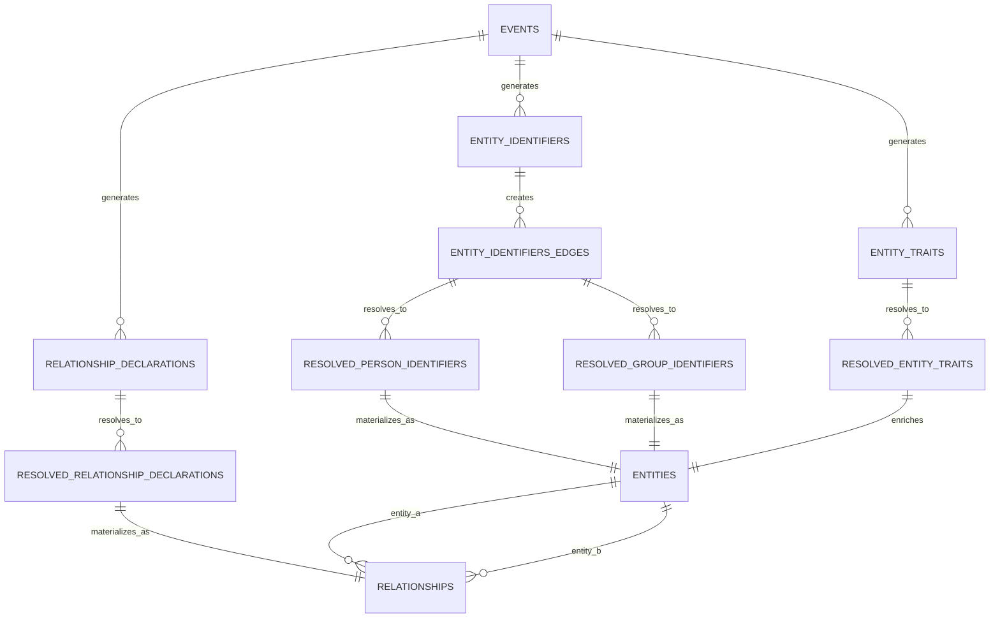

# Database Schema Reference

This document provides a comprehensive reference for the dbt-nexus database
schema, including all entities, relationships, and data flow patterns.

## Schema Overview

The dbt-nexus database schema is organized into five distinct layers, each
serving a specific purpose in the data transformation pipeline:

1. **Raw Data Layer** - Direct source ingestion
2. **Source Event Log Layer** - Source-specific normalization
3. **Core Event Log Layer** - Unified cross-source schema
4. **Identity Resolution Layer** - Entity deduplication and resolution
5. **Final Tables Layer** - Production-ready entities

## Visual Schema Diagram

The complete database schema and data flow can be visualized using the
interactive diagram below. This diagram shows all entities, their relationships,
and the transformation flow from raw data to resolved entities.

### Opening the Schema Diagram

The database schema diagram is available as an interactive draw.io file:

1. **File Location**: `database-diagram.xml` in the package root
2. **Opening Instructions**:
   - Go to [draw.io](https://app.diagrams.net/)
   - Click "Open Existing Diagram"
   - Upload the `database-diagram.xml` file
   - The complete schema will be displayed with interactive navigation

### Diagram Sections

The diagram is organized into color-coded sections:

- **🔵 Raw Data** (Blue) - Source tables with minimal processing
- **🟠 Source Event Log** (Orange) - Source-specific normalized events
- **🔴 Core Event Log** (Red) - Unified event schema
- **🟣 Identity Resolution** (Purple) - Resolved identifiers and traits
- **🟢 Final Tables** (Green) - Production entity tables

## Entity Reference

### Core Entities

#### Events

**Purpose**: Central log of all activities across data sources

| Column              | Type      | Description                   | Required | Notes                                  |
| ------------------- | --------- | ----------------------------- | -------- | -------------------------------------- |
| `event_id`          | STRING    | Unique event identifier       | ✅       | Primary key, UUID format               |
| `occurred_at`       | TIMESTAMP | When the event occurred       | ✅       | Business timestamp                     |
| `event_name`        | STRING    | Specific event name           | ✅       | e.g., 'email_sent', 'app_installed'    |
| `event_description` | STRING    | Human-readable description    | ❌       | e.g., 'Email sent to john@example.com' |
| `event_type`        | STRING    | Event category                | ✅       | e.g., 'communication', 'product_usage' |
| `source`            | STRING    | Source system name            | ✅       | e.g., 'gmail', 'shopify_partner'       |
| `value`             | NUMERIC   | Numeric value (if applicable) | ❌       | e.g., transaction amount               |
| `value_unit`        | STRING    | Unit of the value field       | ❌       | e.g., 'USD', 'count'                   |
| `_ingested_at`      | TIMESTAMP | When dbt processed the record | ✅       | System timestamp                       |

#### Column Naming Strategy

The events table uses a specific naming strategy to avoid conflicts in unions
and joins:

**Prefixed Columns** (require `event_` prefix):

- `event_id` - Generic "id" would conflict across sources
- `event_name` - Generic "name" would conflict across sources
- `event_description` - Generic "description" would conflict across sources
- `event_type` - Generic "type" would conflict across sources

**Non-Prefixed Columns** (standard event tracking fields):

- `value` - Standard field in event tracking systems (GA4, etc.)
- `significance` - Specific to event scoring, not generic
- `occurred_at` - Standard timestamp field
- `source` - Standard source attribution field

This strategy ensures compatibility with industry-standard event tracking while
preventing column name conflicts during data unioning.

#### Entities (`nexus_entities`)

**Purpose**: Unified table for all resolved entities (persons, groups, and
custom entity types)

| Column             | Type      | Description                   | Required | Notes                              |
| ------------------ | --------- | ----------------------------- | -------- | ---------------------------------- |
| `entity_id`        | STRING    | Unique entity identifier      | ✅       | Primary key, varies by entity_type |
| `entity_type`      | STRING    | Type of entity                | ✅       | 'person', 'group', etc.            |
| `event_id`         | STRING    | Reference to source event     | ✅       | Foreign key to events.id           |
| `edge_id`          | STRING    | Groups related identifiers    | ✅       | Surrogate key for grouping         |
| `identifier_type`  | STRING    | Type of identifier            | ✅       | e.g., 'email', 'phone', 'user_id'  |
| `identifier_value` | STRING    | Actual identifier value       | ✅       | e.g., 'john@example.com'           |
| `source`           | STRING    | Source system                 | ✅       | Source attribution                 |
| `occurred_at`      | TIMESTAMP | When identifier was collected | ✅       | Business timestamp                 |
| `_ingested_at`     | TIMESTAMP | When processed by dbt         | ✅       | System timestamp                   |

**Note**: The `nexus_entities` table is populated from the union of
entity_type-specific columns. For persons, columns like `email`, `name`, `phone`
are populated; for groups, columns like `domain`, `company_name` are populated.
Other entity types follow their own schema.

#### Entity Traits (`nexus_entity_traits`)

**Purpose**: Attributes and characteristics for all entity types

| Column             | Type      | Description                      | Required | Notes                                   |
| ------------------ | --------- | -------------------------------- | -------- | --------------------------------------- |
| `entity_trait_id`  | STRING    | Unique trait record              | ✅       | Primary key (ent*tr* prefix)            |
| `event_id`         | STRING    | Reference to source event        | ✅       | Foreign key to events.event_id          |
| `entity_type`      | STRING    | Type of entity                   | ✅       | 'person', 'group', etc.                 |
| `identifier_type`  | STRING    | Type used to identify the entity | ✅       | e.g., 'email', 'domain'                 |
| `identifier_value` | STRING    | Value used to identify entity    | ✅       | e.g., 'john@example.com', 'example.com' |
| `trait_name`       | STRING    | Name of the trait                | ✅       | e.g., 'name', 'title', 'company_name'   |
| `trait_value`      | STRING    | Value of the trait               | ✅       | e.g., 'John Smith', 'Acme Corp'         |
| `role`             | STRING    | Entity's role in event           | ❌       | e.g., 'sender', 'organizer'             |
| `source`           | STRING    | Source system                    | ✅       | Source attribution                      |
| `occurred_at`      | TIMESTAMP | When trait was collected         | ✅       | Business timestamp                      |
| `_ingested_at`     | TIMESTAMP | When processed by dbt            | ✅       | System timestamp                        |

#### Relationship Declarations (`nexus_relationship_declarations`)

**Purpose**: Declared relationships between any two entities

| Column                        | Type      | Description                     | Required | Notes                               |
| ----------------------------- | --------- | ------------------------------- | -------- | ----------------------------------- |
| `relationship_declaration_id` | STRING    | Unique declaration record       | ✅       | Primary key (rel*decl* prefix)      |
| `event_id`                    | STRING    | Reference to source event       | ✅       | Foreign key to events.event_id      |
| `occurred_at`                 | TIMESTAMP | When relationship was declared  | ✅       | Business timestamp                  |
| `entity_a_identifier`         | STRING    | Entity A identifier value       | ✅       | e.g., email address                 |
| `entity_a_identifier_type`    | STRING    | Entity A identifier type        | ✅       | e.g., 'email'                       |
| `entity_a_type`               | STRING    | Entity A type                   | ✅       | e.g., 'person'                      |
| `entity_a_role`               | STRING    | Entity A's role in relationship | ❌       | e.g., 'member', 'owner'             |
| `entity_b_identifier`         | STRING    | Entity B identifier value       | ✅       | e.g., domain                        |
| `entity_b_identifier_type`    | STRING    | Entity B identifier type        | ✅       | e.g., 'domain'                      |
| `entity_b_type`               | STRING    | Entity B type                   | ✅       | e.g., 'group'                       |
| `entity_b_role`               | STRING    | Entity B's role in relationship | ❌       | e.g., 'organization'                |
| `relationship_type`           | STRING    | Type of relationship            | ✅       | e.g., 'membership', 'ownership'     |
| `relationship_direction`      | STRING    | Relationship directionality     | ✅       | 'a_to_b', 'b_to_a', 'bidirectional' |
| `is_active`                   | BOOLEAN   | Whether relationship is active  | ✅       | true/false                          |
| `source`                      | STRING    | Source system                   | ✅       | Source attribution                  |

### Resolved Entities

#### Resolved Person Identifiers (`nexus_resolved_person_identifiers`)

**Purpose**: Deduplicated person identifiers after identity resolution

| Column             | Type      | Description                   | Required | Notes                            |
| ------------------ | --------- | ----------------------------- | -------- | -------------------------------- |
| `person_id`        | STRING    | Resolved person identifier    | ✅       | Generated by identity resolution |
| `identifier_type`  | STRING    | Type of identifier            | ✅       | e.g., 'email', 'phone'           |
| `identifier_value` | STRING    | Actual identifier value       | ✅       | e.g., 'john@example.com'         |
| `source`           | STRING    | Source of earliest occurrence | ✅       | Source attribution               |
| `occurred_at`      | TIMESTAMP | When first collected          | ✅       | Earliest business timestamp      |

#### Resolved Group Identifiers (`nexus_resolved_group_identifiers`)

**Purpose**: Deduplicated group identifiers after identity resolution

| Column             | Type      | Description                   | Required | Notes                            |
| ------------------ | --------- | ----------------------------- | -------- | -------------------------------- |
| `group_id`         | STRING    | Resolved group identifier     | ✅       | Generated by identity resolution |
| `identifier_type`  | STRING    | Type of identifier            | ✅       | e.g., 'domain', 'company_id'     |
| `identifier_value` | STRING    | Actual identifier value       | ✅       | e.g., 'example.com'              |
| `source`           | STRING    | Source of earliest occurrence | ✅       | Source attribution               |
| `occurred_at`      | TIMESTAMP | When first collected          | ✅       | Earliest business timestamp      |

#### Resolved Group Traits

**Purpose**: Consolidated group attributes with latest values

| Column        | Type      | Description                     | Required | Notes                            |
| ------------- | --------- | ------------------------------- | -------- | -------------------------------- |
| `group_id`    | STRING    | Resolved group identifier       | ✅       | Links to resolved identifiers    |
| `trait_name`  | STRING    | Name of the trait               | ✅       | e.g., 'company_name', 'industry' |
| `trait_value` | STRING    | Most recent trait value         | ✅       | Latest value from any source     |
| `source`      | STRING    | Source of latest value          | ✅       | Source attribution               |
| `occurred_at` | TIMESTAMP | When latest value was collected | ✅       | Business timestamp               |

#### Resolved Membership Identifiers

**Purpose**: Resolved relationships between persons and groups

| Column        | Type      | Description                      | Required | Notes                  |
| ------------- | --------- | -------------------------------- | -------- | ---------------------- |
| `id`          | STRING    | Unique membership identifier     | ✅       | Primary key            |
| `person_id`   | STRING    | Resolved person identifier       | ✅       | Foreign key to persons |
| `group_id`    | STRING    | Resolved group identifier        | ✅       | Foreign key to groups  |
| `role`        | STRING    | Current role in the group        | ❌       | Most recent role       |
| `source`      | STRING    | Source of latest information     | ✅       | Source attribution     |
| `occurred_at` | TIMESTAMP | When membership was last updated | ✅       | Business timestamp     |

### Final Production Tables

#### Entities (`nexus_entities`)

**Purpose**: Production table with complete entity profiles for all entity types

| Column            | Type      | Description                     | Required | Notes                               |
| ----------------- | --------- | ------------------------------- | -------- | ----------------------------------- |
| `entity_id`       | STRING    | Unique entity identifier        | ✅       | Primary key (person_id or group_id) |
| `entity_type`     | STRING    | Type of entity                  | ✅       | 'person', 'group', custom types     |
| `email`           | STRING    | Primary email (persons)         | ❌       | Most recent, person entities only   |
| `name`            | STRING    | Full name (persons/groups)      | ❌       | Most recent                         |
| `phone`           | STRING    | Phone number (persons)          | ❌       | Most recent, person entities only   |
| `title`           | STRING    | Job title (persons)             | ❌       | Most recent, person entities only   |
| `domain`          | STRING    | Primary domain (groups)         | ❌       | Most recent, group entities only    |
| `company_name`    | STRING    | Organization name (groups)      | ❌       | Most recent, group entities only    |
| `industry`        | STRING    | Industry (groups)               | ❌       | Most recent, group entities only    |
| `primary_source`  | STRING    | Source with earliest identifier | ✅       | Source attribution                  |
| `last_updated_at` | TIMESTAMP | When entity was last updated    | ✅       | Most recent trait timestamp         |

**Note**: Columns are populated based on `entity_type`. Person entities have
email/name/phone populated; group entities have domain/company_name populated.

#### Relationships (`nexus_relationships`)

**Purpose**: Production table with resolved relationships between any two
entities

| Column              | Type      | Description                              | Required | Notes                             |
| ------------------- | --------- | ---------------------------------------- | -------- | --------------------------------- |
| `relationship_id`   | STRING    | Unique relationship identifier           | ✅       | Primary key (rel\_ prefix)        |
| `entity_a_id`       | STRING    | Entity A identifier                      | ✅       | Foreign key to nexus_entities     |
| `entity_b_id`       | STRING    | Entity B identifier                      | ✅       | Foreign key to nexus_entities     |
| `relationship_type` | STRING    | Type of relationship                     | ✅       | e.g., 'membership', 'ownership'   |
| `is_active`         | BOOLEAN   | Whether relationship is currently active | ✅       | true/false                        |
| `established_at`    | TIMESTAMP | When relationship was first declared     | ✅       | Earliest declaration timestamp    |
| `last_updated_at`   | TIMESTAMP | When relationship was last updated       | ✅       | Most recent declaration timestamp |
| `primary_source`    | STRING    | Source of earliest declaration           | ✅       | Source attribution                |

**Backward Compatibility**: Legacy views available in client projects:

- `persons` - Filters `nexus_entities WHERE entity_type = 'person'`
- `groups` - Filters `nexus_entities WHERE entity_type = 'group'`
- `memberships` - Filters
  `nexus_relationships WHERE relationship_type = 'membership'`

## Relationships and Constraints

### Primary Relationships



### Key Constraints

#### Uniqueness Constraints

- `events.id` - Unique across all events
- `person_identifiers.id` - Unique across all person identifier records
- `persons.person_id` - Unique resolved person identifiers
- `groups.group_id` - Unique resolved group identifiers

#### Referential Integrity

- All `event_id` fields reference `events.id`
- `memberships.person_id` references `persons.person_id`
- `memberships.group_id` references `groups.group_id`

#### Business Rules

- Each `edge_id` groups related identifiers/traits from the same source record
- Identity resolution preserves earliest occurrence timestamps
- Trait resolution preserves latest values with source attribution
- Membership relationships maintain current role information

## Data Flow Patterns

### Source Data Ingestion

1. Raw data arrives via ETL processes with `synced_at` timestamps
2. Source adapters normalize to standard interfaces
3. Incremental processing based on `_ingested_at` watermarks

### Identity Resolution Flow

1. **Edge Generation**: Create connections between related identifiers
2. **Edge Normalization**: Eliminate directional duplicates
3. **Connected Components**: Find groups of connected identifiers
4. **Entity Assignment**: Generate unique IDs for each component

### Trait Resolution Flow

1. **Collection**: Gather traits from all sources
2. **Association**: Link traits to resolved entities
3. **Deduplication**: Select most recent values per entity
4. **Materialization**: Create final entity profiles

## Performance Considerations

### Indexing Strategy

```sql
-- Recommended indexes for optimal performance
CREATE INDEX idx_events_occurred_at ON events(occurred_at);
CREATE INDEX idx_events_source ON events(source);
CREATE INDEX idx_person_identifiers_type_value ON person_identifiers(identifier_type, identifier_value);
CREATE INDEX idx_group_identifiers_type_value ON group_identifiers(identifier_type, identifier_value);
```

### Partitioning Strategy

```sql
-- Recommended partitioning for large tables
PARTITION BY DATE(occurred_at)  -- For events and time-series data
CLUSTER BY person_id, group_id  -- For resolved entities
```

## Related Documentation

- [Architecture Overview](../explanations/architecture.md) - High-level
  architectural concepts
- [Identity Resolution Logic](../explanations/identity-resolution.md) - Detailed
  resolution algorithms
- [Data Contracts](data-contracts/) - Interface specifications
- [Model Reference](models/) - Individual model documentation
