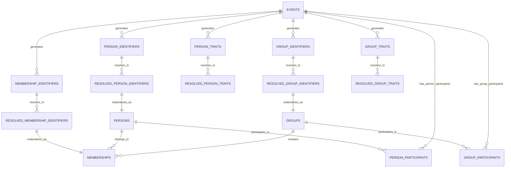

# Database Schema Reference

This document provides a comprehensive reference for the dbt-nexus database
schema, including all entities, relationships, and data flow patterns.

## Schema Overview

The dbt-nexus database schema is organized into five distinct layers, each
serving a specific purpose in the data transformation pipeline:

1. **Raw Data Layer** - Direct source ingestion
2. **Source Event Log Layer** - Source-specific normalization
3. **Core Event Log Layer** - Unified cross-source schema
4. **Identity Resolution Layer** - Entity deduplication and resolution
5. **Final Tables Layer** - Production-ready entities

## Visual Schema Diagram

The complete database schema and data flow can be visualized using the
interactive diagram below. This diagram shows all entities, their relationships,
and the transformation flow from raw data to resolved entities.

### Opening the Schema Diagram

The database schema diagram is available as an interactive draw.io file:

1. **File Location**: `database-diagram.xml` in the package root
2. **Opening Instructions**:
   - Go to [draw.io](https://app.diagrams.net/)
   - Click "Open Existing Diagram"
   - Upload the `database-diagram.xml` file
   - The complete schema will be displayed with interactive navigation

### Diagram Sections

The diagram is organized into color-coded sections:

- **🔵 Raw Data** (Blue) - Source tables with minimal processing
- **🟠 Source Event Log** (Orange) - Source-specific normalized events
- **🔴 Core Event Log** (Red) - Unified event schema
- **🟣 Identity Resolution** (Purple) - Resolved identifiers and traits
- **🟢 Final Tables** (Green) - Production entity tables

## Entity Reference

### Core Entities

#### Events

**Purpose**: Central log of all activities across data sources

| Column              | Type      | Description                   | Required | Notes                                  |
| ------------------- | --------- | ----------------------------- | -------- | -------------------------------------- |
| `event_id`          | STRING    | Unique event identifier       | ✅       | Primary key, UUID format               |
| `occurred_at`       | TIMESTAMP | When the event occurred       | ✅       | Business timestamp                     |
| `event_name`        | STRING    | Specific event name           | ✅       | e.g., 'email_sent', 'app_installed'    |
| `event_description` | STRING    | Human-readable description    | ❌       | e.g., 'Email sent to john@example.com' |
| `event_type`        | STRING    | Event category                | ✅       | e.g., 'communication', 'product_usage' |
| `source`            | STRING    | Source system name            | ✅       | e.g., 'gmail', 'shopify_partner'       |
| `value`             | NUMERIC   | Numeric value (if applicable) | ❌       | e.g., transaction amount               |
| `value_unit`        | STRING    | Unit of the value field       | ❌       | e.g., 'USD', 'count'                   |
| `_ingested_at`      | TIMESTAMP | When dbt processed the record | ✅       | System timestamp                       |

#### Column Naming Strategy

The events table uses a specific naming strategy to avoid conflicts in unions
and joins:

**Prefixed Columns** (require `event_` prefix):

- `event_id` - Generic "id" would conflict across sources
- `event_name` - Generic "name" would conflict across sources
- `event_description` - Generic "description" would conflict across sources
- `event_type` - Generic "type" would conflict across sources

**Non-Prefixed Columns** (standard event tracking fields):

- `value` - Standard field in event tracking systems (GA4, etc.)
- `significance` - Specific to event scoring, not generic
- `occurred_at` - Standard timestamp field
- `source` - Standard source attribution field

This strategy ensures compatibility with industry-standard event tracking while
preventing column name conflicts during data unioning.

#### Person Identifiers

**Purpose**: Normalized identifiers for individual entities

| Column             | Type      | Description                   | Required | Notes                             |
| ------------------ | --------- | ----------------------------- | -------- | --------------------------------- |
| `id`               | STRING    | Unique identifier record      | ✅       | Primary key                       |
| `event_id`         | STRING    | Reference to source event     | ✅       | Foreign key to events.id          |
| `edge_id`          | STRING    | Groups related identifiers    | ✅       | Surrogate key for grouping        |
| `identifier_type`  | STRING    | Type of identifier            | ✅       | e.g., 'email', 'phone', 'user_id' |
| `identifier_value` | STRING    | Actual identifier value       | ✅       | e.g., 'john@example.com'          |
| `source`           | STRING    | Source system                 | ✅       | Source attribution                |
| `occurred_at`      | TIMESTAMP | When identifier was collected | ✅       | Business timestamp                |
| `_ingested_at`     | TIMESTAMP | When processed by dbt         | ✅       | System timestamp                  |

#### Person Traits

**Purpose**: Attributes and characteristics of persons

| Column         | Type      | Description               | Required | Notes                             |
| -------------- | --------- | ------------------------- | -------- | --------------------------------- |
| `id`           | STRING    | Unique trait record       | ✅       | Primary key                       |
| `event_id`     | STRING    | Reference to source event | ✅       | Foreign key to events.id          |
| `edge_id`      | STRING    | Groups related traits     | ✅       | Surrogate key for grouping        |
| `trait_name`   | STRING    | Name of the trait         | ✅       | e.g., 'name', 'title', 'timezone' |
| `trait_value`  | STRING    | Value of the trait        | ✅       | e.g., 'John Smith', 'Manager'     |
| `source`       | STRING    | Source system             | ✅       | Source attribution                |
| `occurred_at`  | TIMESTAMP | When trait was collected  | ✅       | Business timestamp                |
| `_ingested_at` | TIMESTAMP | When processed by dbt     | ✅       | System timestamp                  |

#### Group Identifiers

**Purpose**: Normalized identifiers for organizational entities

| Column             | Type      | Description                   | Required | Notes                          |
| ------------------ | --------- | ----------------------------- | -------- | ------------------------------ |
| `id`               | STRING    | Unique identifier record      | ✅       | Primary key                    |
| `event_id`         | STRING    | Reference to source event     | ✅       | Foreign key to events.id       |
| `edge_id`          | STRING    | Groups related identifiers    | ✅       | Surrogate key for grouping     |
| `identifier_type`  | STRING    | Type of identifier            | ✅       | e.g., 'domain', 'company_id'   |
| `identifier_value` | STRING    | Actual identifier value       | ✅       | e.g., 'example.com', 'COMP123' |
| `source`           | STRING    | Source system                 | ✅       | Source attribution             |
| `occurred_at`      | TIMESTAMP | When identifier was collected | ✅       | Business timestamp             |
| `_ingested_at`     | TIMESTAMP | When processed by dbt         | ✅       | System timestamp               |

#### Group Traits

**Purpose**: Attributes and characteristics of groups/organizations

| Column         | Type      | Description               | Required | Notes                            |
| -------------- | --------- | ------------------------- | -------- | -------------------------------- |
| `id`           | STRING    | Unique trait record       | ✅       | Primary key                      |
| `event_id`     | STRING    | Reference to source event | ✅       | Foreign key to events.id         |
| `edge_id`      | STRING    | Groups related traits     | ✅       | Surrogate key for grouping       |
| `trait_name`   | STRING    | Name of the trait         | ✅       | e.g., 'company_name', 'industry' |
| `trait_value`  | STRING    | Value of the trait        | ✅       | e.g., 'Acme Corp', 'Technology'  |
| `source`       | STRING    | Source system             | ✅       | Source attribution               |
| `occurred_at`  | TIMESTAMP | When trait was collected  | ✅       | Business timestamp               |
| `_ingested_at` | TIMESTAMP | When processed by dbt     | ✅       | System timestamp                 |

#### Membership Identifiers

**Purpose**: Relationships between persons and groups

| Column                   | Type      | Description                     | Required | Notes                            |
| ------------------------ | --------- | ------------------------------- | -------- | -------------------------------- |
| `id`                     | STRING    | Unique membership record        | ✅       | Primary key                      |
| `event_id`               | STRING    | Reference to source event       | ✅       | Foreign key to events.id         |
| `person_identifier`      | STRING    | Person identifier value         | ✅       | e.g., email address              |
| `person_identifier_type` | STRING    | Person identifier type          | ✅       | e.g., 'email'                    |
| `group_identifier`       | STRING    | Group identifier value          | ✅       | e.g., domain or company ID       |
| `group_identifier_type`  | STRING    | Group identifier type           | ✅       | e.g., 'domain'                   |
| `role`                   | STRING    | Person's role in the group      | ❌       | e.g., 'owner', 'admin', 'member' |
| `source`                 | STRING    | Source system                   | ✅       | Source attribution               |
| `occurred_at`            | TIMESTAMP | When membership was established | ✅       | Business timestamp               |
| `_ingested_at`           | TIMESTAMP | When processed by dbt           | ✅       | System timestamp                 |

### Resolved Entities

#### Resolved Person Identifiers

**Purpose**: Deduplicated person identifiers after identity resolution

| Column             | Type      | Description                   | Required | Notes                            |
| ------------------ | --------- | ----------------------------- | -------- | -------------------------------- |
| `person_id`        | STRING    | Resolved person identifier    | ✅       | Generated by identity resolution |
| `identifier_type`  | STRING    | Type of identifier            | ✅       | e.g., 'email', 'phone'           |
| `identifier_value` | STRING    | Actual identifier value       | ✅       | e.g., 'john@example.com'         |
| `source`           | STRING    | Source of earliest occurrence | ✅       | Source attribution               |
| `occurred_at`      | TIMESTAMP | When first collected          | ✅       | Earliest business timestamp      |

#### Resolved Person Traits

**Purpose**: Consolidated person attributes with latest values

| Column        | Type      | Description                     | Required | Notes                         |
| ------------- | --------- | ------------------------------- | -------- | ----------------------------- |
| `person_id`   | STRING    | Resolved person identifier      | ✅       | Links to resolved identifiers |
| `trait_name`  | STRING    | Name of the trait               | ✅       | e.g., 'name', 'title'         |
| `trait_value` | STRING    | Most recent trait value         | ✅       | Latest value from any source  |
| `source`      | STRING    | Source of latest value          | ✅       | Source attribution            |
| `occurred_at` | TIMESTAMP | When latest value was collected | ✅       | Business timestamp            |

#### Resolved Group Identifiers

**Purpose**: Deduplicated group identifiers after identity resolution

| Column             | Type      | Description                   | Required | Notes                            |
| ------------------ | --------- | ----------------------------- | -------- | -------------------------------- |
| `group_id`         | STRING    | Resolved group identifier     | ✅       | Generated by identity resolution |
| `identifier_type`  | STRING    | Type of identifier            | ✅       | e.g., 'domain', 'company_id'     |
| `identifier_value` | STRING    | Actual identifier value       | ✅       | e.g., 'example.com'              |
| `source`           | STRING    | Source of earliest occurrence | ✅       | Source attribution               |
| `occurred_at`      | TIMESTAMP | When first collected          | ✅       | Earliest business timestamp      |

#### Resolved Group Traits

**Purpose**: Consolidated group attributes with latest values

| Column        | Type      | Description                     | Required | Notes                            |
| ------------- | --------- | ------------------------------- | -------- | -------------------------------- |
| `group_id`    | STRING    | Resolved group identifier       | ✅       | Links to resolved identifiers    |
| `trait_name`  | STRING    | Name of the trait               | ✅       | e.g., 'company_name', 'industry' |
| `trait_value` | STRING    | Most recent trait value         | ✅       | Latest value from any source     |
| `source`      | STRING    | Source of latest value          | ✅       | Source attribution               |
| `occurred_at` | TIMESTAMP | When latest value was collected | ✅       | Business timestamp               |

#### Resolved Membership Identifiers

**Purpose**: Resolved relationships between persons and groups

| Column        | Type      | Description                      | Required | Notes                  |
| ------------- | --------- | -------------------------------- | -------- | ---------------------- |
| `id`          | STRING    | Unique membership identifier     | ✅       | Primary key            |
| `person_id`   | STRING    | Resolved person identifier       | ✅       | Foreign key to persons |
| `group_id`    | STRING    | Resolved group identifier        | ✅       | Foreign key to groups  |
| `role`        | STRING    | Current role in the group        | ❌       | Most recent role       |
| `source`      | STRING    | Source of latest information     | ✅       | Source attribution     |
| `occurred_at` | TIMESTAMP | When membership was last updated | ✅       | Business timestamp     |

### Final Production Tables

#### Persons

**Purpose**: Production table with complete person profiles

| Column          | Type      | Description                   | Required | Notes                |
| --------------- | --------- | ----------------------------- | -------- | -------------------- |
| `person_id`     | STRING    | Unique person identifier      | ✅       | Primary key          |
| `email`         | STRING    | Primary email address         | ❌       | Most recent email    |
| `name`          | STRING    | Full name                     | ❌       | Most recent name     |
| `phone`         | STRING    | Phone number                  | ❌       | Most recent phone    |
| `title`         | STRING    | Job title                     | ❌       | Most recent title    |
| `timezone`      | STRING    | Timezone                      | ❌       | Most recent timezone |
| `_last_updated` | TIMESTAMP | When profile was last updated | ✅       | System timestamp     |

#### Groups

**Purpose**: Production table with complete group/organization profiles

| Column          | Type      | Description                   | Required | Notes                |
| --------------- | --------- | ----------------------------- | -------- | -------------------- |
| `group_id`      | STRING    | Unique group identifier       | ✅       | Primary key          |
| `domain`        | STRING    | Primary domain                | ❌       | Most recent domain   |
| `company_name`  | STRING    | Organization name             | ❌       | Most recent name     |
| `industry`      | STRING    | Industry classification       | ❌       | Most recent industry |
| `company_size`  | STRING    | Organization size             | ❌       | Most recent size     |
| `shopify_id`    | STRING    | Shopify identifier            | ❌       | If applicable        |
| `_last_updated` | TIMESTAMP | When profile was last updated | ✅       | System timestamp     |

#### Memberships

**Purpose**: Production table with person-group relationships

| Column           | Type      | Description                            | Required | Notes                  |
| ---------------- | --------- | -------------------------------------- | -------- | ---------------------- |
| `id`             | STRING    | Unique membership identifier           | ✅       | Primary key            |
| `person_id`      | STRING    | Person identifier                      | ✅       | Foreign key to persons |
| `group_id`       | STRING    | Group identifier                       | ✅       | Foreign key to groups  |
| `role`           | STRING    | Role in the organization               | ❌       | Current role           |
| `source`         | STRING    | Source of relationship data            | ✅       | Source attribution     |
| `established_at` | TIMESTAMP | When relationship was first identified | ✅       | Business timestamp     |
| `_last_updated`  | TIMESTAMP | When relationship was last updated     | ✅       | System timestamp       |

#### Person Participants

**Purpose**: Links between persons and events with role context

| Column                  | Type   | Description                          | Required | Notes                                                                       |
| ----------------------- | ------ | ------------------------------------ | -------- | --------------------------------------------------------------------------- |
| `person_participant_id` | STRING | Unique person-event participation ID | ✅       | Primary key                                                                 |
| `event_id`              | STRING | Event identifier                     | ✅       | Foreign key to events                                                       |
| `person_id`             | STRING | Person identifier                    | ✅       | Foreign key to persons                                                      |
| `role`                  | STRING | Person's role in the event           | ❌       | e.g., 'sender', 'recipient', 'organizer', 'attendee', 'contact', 'assignee' |

#### Group Participants

**Purpose**: Links between groups and events

| Column                 | Type   | Description                         | Required | Notes                 |
| ---------------------- | ------ | ----------------------------------- | -------- | --------------------- |
| `group_participant_id` | STRING | Unique group-event participation ID | ✅       | Primary key           |
| `event_id`             | STRING | Event identifier                    | ✅       | Foreign key to events |
| `group_id`             | STRING | Group identifier                    | ✅       | Foreign key to groups |

## Relationships and Constraints

### Primary Relationships



### Key Constraints

#### Uniqueness Constraints

- `events.id` - Unique across all events
- `person_identifiers.id` - Unique across all person identifier records
- `persons.person_id` - Unique resolved person identifiers
- `groups.group_id` - Unique resolved group identifiers

#### Referential Integrity

- All `event_id` fields reference `events.id`
- `memberships.person_id` references `persons.person_id`
- `memberships.group_id` references `groups.group_id`

#### Business Rules

- Each `edge_id` groups related identifiers/traits from the same source record
- Identity resolution preserves earliest occurrence timestamps
- Trait resolution preserves latest values with source attribution
- Membership relationships maintain current role information

## Data Flow Patterns

### Source Data Ingestion

1. Raw data arrives via ETL processes with `synced_at` timestamps
2. Source adapters normalize to standard interfaces
3. Incremental processing based on `_ingested_at` watermarks

### Identity Resolution Flow

1. **Edge Generation**: Create connections between related identifiers
2. **Edge Normalization**: Eliminate directional duplicates
3. **Connected Components**: Find groups of connected identifiers
4. **Entity Assignment**: Generate unique IDs for each component

### Trait Resolution Flow

1. **Collection**: Gather traits from all sources
2. **Association**: Link traits to resolved entities
3. **Deduplication**: Select most recent values per entity
4. **Materialization**: Create final entity profiles

## Performance Considerations

### Indexing Strategy

```sql
-- Recommended indexes for optimal performance
CREATE INDEX idx_events_occurred_at ON events(occurred_at);
CREATE INDEX idx_events_source ON events(source);
CREATE INDEX idx_person_identifiers_type_value ON person_identifiers(identifier_type, identifier_value);
CREATE INDEX idx_group_identifiers_type_value ON group_identifiers(identifier_type, identifier_value);
```

### Partitioning Strategy

```sql
-- Recommended partitioning for large tables
PARTITION BY DATE(occurred_at)  -- For events and time-series data
CLUSTER BY person_id, group_id  -- For resolved entities
```

## Related Documentation

- [Architecture Overview](../explanations/architecture.md) - High-level
  architectural concepts
- [Identity Resolution Logic](../explanations/identity-resolution.md) - Detailed
  resolution algorithms
- [Data Contracts](data-contracts/) - Interface specifications
- [Model Reference](models/) - Individual model documentation
