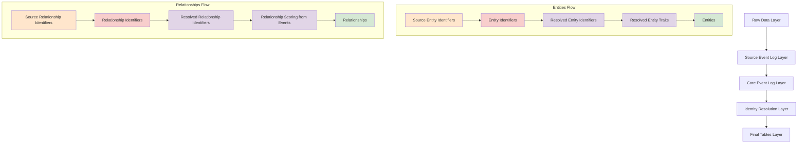

# Entities and Relationships Architecture

## Overview

This document outlines the architecture for **entities and relationships** in
the dbt-nexus package. This unified approach enables tracking of any type of
entity (persons, groups, contracts, products, locations, etc.) and their
explicit relationships with each other through a single, extensible system.

## Core Insight

The fundamental insight is that **entities have relationships with each other**
and use **entity resolution** (identity resolution) to resolve their data across
different systems. This eliminates the artificial boundaries between persons,
groups, and other entity types while providing a natural foundation for any type
of relationship.

## Business Context

In any business context, entities and their relationships are fundamental:

### **Entity Types**

- **Persons**: Individual people (employees, clients, contacts)
- **Groups**: Organizations, households, teams, departments
- **Contracts**: Legal agreements, deals, subscriptions, accounts
- **Products**: Software products, services, offerings
- **Locations**: Physical locations, offices, stores, franchises
- **Tasks**: Work items, projects, assignments, deliverables
- **Events**: Recurring events, programs, campaigns

### **Relationship Examples**

- **Advisor-Client**: Person serves person OR person serves group (household)
- **Manager-Employee**: Person manages person
- **Franchisee-Location**: Person manages location
- **Agency-Client**: Group serves group
- **Contract-Customer**: Contract belongs to person OR group
- **Product-User**: Person uses product

Unlike memberships (entity belongs TO a group), relationships are **explicit
connections** between entities that represent service, responsibility,
partnership, or other business relationships.

## Architecture Design

### Core Philosophy

The entities and relationships system follows nexus architectural principles:

1. **Entity-Centric**: All business objects are entities with consistent
   structure
2. **Universal Relationships**: Any entity can relate to any other entity
3. **Deterministic**: Relationships are explicitly declared in source data
4. **Source-Agnostic**: Works with any data source that declares
   entities/relationships
5. **Layered Processing**: Follows the same 5-layer architecture
6. **Incremental**: Supports incremental processing and updates
7. **Temporal**: Maintains entity and relationship history

### Data Flow Architecture



## Schema Design

### Layer 2: Source Event Log

#### Source Entity Identifiers

**Purpose**: Normalize entity identifiers from all source systems

```sql
-- Model: source_entity_identifiers
{
  id: STRING,                           -- Unique source identifier record
  event_id: STRING,                     -- Reference to source event (FK)
  entity_identifier: STRING,            -- Identifier value (email, domain, contract_id, etc.)
  entity_identifier_type: STRING,       -- Type of identifier
  entity_type: STRING,                  -- Type of entity being identified
  source: STRING,                       -- Source system name
  occurred_at: TIMESTAMP,               -- When identifier was collected
  _ingested_at: TIMESTAMP               -- Processing timestamp
}
```

**Entity Types**:

- `person` - Individual people
- `group` - Organizations, households, teams
- `contract` - Agreements, subscriptions, accounts
- `product` - Software, services, offerings
- `location` - Physical locations, offices, stores
- `event_series` - Recurring events, campaigns

#### Source Entity Traits

**Purpose**: Normalize entity attributes from all source systems

```sql
-- Model: source_entity_traits
{
  id: STRING,                           -- Unique source trait record
  event_id: STRING,                     -- Reference to source event (FK)
  entity_identifier: STRING,            -- Entity identifier
  entity_identifier_type: STRING,       -- Identifier type
  entity_type: STRING,                  -- Type of entity
  trait_name: STRING,                   -- Name of the trait
  trait_value: STRING,                  -- Value of the trait
  source: STRING,                       -- Source system
  occurred_at: TIMESTAMP,               -- When trait was collected
  _ingested_at: TIMESTAMP               -- Processing timestamp
}
```

#### Source Relationship Identifiers

**Purpose**: Normalize relationship declarations from source systems

```sql
-- Model: source_relationship_identifiers
{
  id: STRING,                           -- Unique source relationship record
  event_id: STRING,                     -- Reference to source event (FK)
  entity_a_identifier: STRING,          -- First entity identifier
  entity_a_identifier_type: STRING,     -- Type of entity A identifier
  entity_a_type: STRING,                -- Type of entity A
  entity_b_identifier: STRING,          -- Second entity identifier
  entity_b_identifier_type: STRING,     -- Type of entity B identifier
  entity_b_type: STRING,                -- Type of entity B
  relationship_type: STRING,            -- Source-specific relationship type
  relationship_direction: STRING,       -- Directional indicator
  entity_a_role: STRING,                -- Entity A's role in relationship
  entity_b_role: STRING,                -- Entity B's role in relationship
  is_active: BOOLEAN,                   -- Whether relationship is currently active
  source: STRING,                       -- Source system name
  occurred_at: TIMESTAMP,               -- When relationship was established/updated
  _ingested_at: TIMESTAMP               -- Processing timestamp
}
```

### Layer 3: Core Event Log

#### Entity Identifiers

**Purpose**: Unified entity identifier schema across all sources

```sql
-- Model: entity_identifiers
{
  id: STRING,                           -- Unique identifier record
  event_id: STRING,                     -- Reference to source event (FK)
  entity_identifier: STRING,            -- Identifier value
  entity_identifier_type: STRING,       -- Type of identifier
  entity_type: STRING,                  -- Type of entity
  source: STRING,                       -- Source system
  occurred_at: TIMESTAMP,               -- When collected
  _ingested_at: TIMESTAMP               -- Processing timestamp
}
```

#### Entity Traits

**Purpose**: Unified entity traits schema across all sources

```sql
-- Model: entity_traits
{
  id: STRING,                           -- Unique trait record
  event_id: STRING,                     -- Reference to source event (FK)
  entity_identifier: STRING,            -- Entity identifier
  entity_identifier_type: STRING,       -- Identifier type
  entity_type: STRING,                  -- Type of entity
  trait_name: STRING,                   -- Name of the trait
  trait_value: STRING,                  -- Value of the trait
  source: STRING,                       -- Source system
  occurred_at: TIMESTAMP,               -- When collected
  _ingested_at: TIMESTAMP               -- Processing timestamp
}
```

#### Relationship Identifiers

**Purpose**: Unified relationship schema across all sources

```sql
-- Model: relationship_identifiers
{
  id: STRING,                           -- Unique relationship identifier
  event_id: STRING,                     -- Reference to source event (FK)
  entity_a_identifier: STRING,          -- First entity identifier
  entity_a_identifier_type: STRING,     -- Type of entity A identifier
  entity_a_type: STRING,                -- Type of entity A
  entity_b_identifier: STRING,          -- Second entity identifier
  entity_b_identifier_type: STRING,     -- Type of entity B identifier
  entity_b_type: STRING,                -- Type of entity B
  relationship_type: STRING,            -- Standardized relationship type
  relationship_direction: STRING,       -- Directional indicator
  entity_a_role: STRING,                -- Entity A's role in relationship
  entity_b_role: STRING,                -- Entity B's role in relationship
  is_active: BOOLEAN,                   -- Whether relationship is currently active
  source: STRING,                       -- Source system
  occurred_at: TIMESTAMP,               -- When established/updated
  _ingested_at: TIMESTAMP               -- Processing timestamp
}
```

### Layer 4: Identity Resolution

#### Resolved Entity Identifiers

**Purpose**: Deduplicated entity identifiers after entity resolution

```sql
-- Model: resolved_entity_identifiers
{
  entity_id: STRING,                    -- Resolved entity identifier (PK)
  entity_type: STRING,                  -- Type of entity
  identifier_type: STRING,              -- Type of identifier
  identifier_value: STRING,             -- Identifier value
  source: STRING,                       -- Source of earliest occurrence
  occurred_at: TIMESTAMP                -- When first collected
}
```

#### Resolved Entity Traits

**Purpose**: Consolidated entity attributes with latest values

```sql
-- Model: resolved_entity_traits
{
  entity_id: STRING,                    -- Resolved entity identifier
  entity_type: STRING,                  -- Type of entity
  trait_name: STRING,                   -- Name of the trait
  trait_value: STRING,                  -- Most recent trait value
  source: STRING,                       -- Source of latest value
  occurred_at: TIMESTAMP                -- When latest value was collected
}
```

#### Resolved Relationship Identifiers

**Purpose**: Deduplicated relationships after entity resolution

```sql
-- Model: resolved_relationship_identifiers
{
  id: STRING,                           -- Unique resolved relationship ID
  entity_a_id: STRING,                  -- Resolved entity A identifier (FK)
  entity_a_type: STRING,                -- Type of entity A
  entity_b_id: STRING,                  -- Resolved entity B identifier (FK)
  entity_b_type: STRING,                -- Type of entity B
  relationship_type: STRING,            -- Relationship type
  relationship_direction: STRING,       -- Directional indicator
  entity_a_role: STRING,                -- Entity A's role
  entity_b_role: STRING,                -- Entity B's role
  is_active: BOOLEAN,                   -- Current status
  first_declared_at: TIMESTAMP,         -- When first declared
  last_updated_at: TIMESTAMP,           -- Most recent update
  primary_source: STRING,               -- Primary declaring source
  _resolved_at: TIMESTAMP               -- When resolution occurred
}
```

### Layer 5: Final Tables

#### Entities

**Purpose**: Production table with complete entity profiles

```sql
-- Model: entities
{
  entity_id: STRING,                    -- Unique entity identifier (PK)
  entity_type: STRING,                  -- Type of entity
  name: STRING,                         -- Entity name
  is_active: BOOLEAN,                   -- Currently active

  -- Common attributes (nullable based on entity_type)
  email: STRING,                        -- Email (persons, or primary contact)
  phone: STRING,                        -- Phone number
  domain: STRING,                       -- Domain (groups, or person's company)
  internal: BOOLEAN,                    -- Internal vs external entity

  -- Person-specific attributes
  title: STRING,                        -- Job title
  timezone: STRING,                     -- Timezone

  -- Group-specific attributes
  company_size: STRING,                 -- Organization size
  industry: STRING,                     -- Industry classification

  -- Contract-specific attributes
  contract_value: NUMERIC,              -- Contract value
  contract_start_date: DATE,            -- Contract start
  contract_end_date: DATE,              -- Contract end

  -- Location-specific attributes
  address: STRING,                      -- Physical address
  city: STRING,                         -- City
  state: STRING,                        -- State/province
  country: STRING,                      -- Country

  -- Product-specific attributes
  product_category: STRING,             -- Product category
  product_version: STRING,              -- Version

  -- Metadata
  first_seen_at: TIMESTAMP,             -- When first identified
  last_updated_at: TIMESTAMP,           -- Most recent update
  primary_source: STRING                -- Primary data source
}
```

#### Relationships

**Purpose**: Production table with resolved, scored relationships

```sql
-- Model: relationships
{
  relationship_id: STRING,              -- Unique relationship identifier (PK)
  entity_a_id: STRING,                  -- First entity (FK to entities)
  entity_a_type: STRING,                -- Type of entity A
  entity_b_id: STRING,                  -- Second entity (FK to entities)
  entity_b_type: STRING,                -- Type of entity B
  relationship_type: STRING,            -- Relationship type
  relationship_direction: STRING,       -- Directional indicator
  entity_a_role: STRING,                -- Entity A's role in relationship
  entity_b_role: STRING,                -- Entity B's role in relationship
  is_primary: BOOLEAN,                  -- Primary relationship of this type
  is_active: BOOLEAN,                   -- Currently active

  -- Event-based scoring metrics (when both entities participate in events)
  interaction_score: FLOAT,             -- Score based on shared events (0-1)
  email_interactions: INTEGER,          -- Count of shared email events
  meeting_interactions: INTEGER,        -- Count of shared meeting events
  total_interactions: INTEGER,          -- Total shared events
  first_interaction_at: TIMESTAMP,      -- First shared event
  last_interaction_at: TIMESTAMP,       -- Most recent shared event

  -- Relationship lifecycle
  established_at: TIMESTAMP,            -- When relationship was first declared
  last_updated_at: TIMESTAMP,           -- Most recent declaration update
  primary_source: STRING,               -- Primary declaring source
  _last_calculated: TIMESTAMP           -- When scores were last calculated
}
```

## Naming Conventions

### Entity Type Naming

**Format**: Singular, descriptive nouns

**Examples**:

- `person` - Individual people
- `group` - Organizations, teams, households
- `contract` - Agreements, subscriptions
- `product` - Software, services
- `location` - Physical places
- `campaign` - Marketing campaigns

### Relationship Type Naming

**Format**: `{role_a}_{role_b}` describing the relationship

**Examples**:

- `advisor_client` - Works for person→person OR person→group
- `manager_employee` - Person→person hierarchical relationship
- `franchisee_location` - Person→location management
- `agency_client` - Group→group service relationship
- `customer_contract` - Person/group→contract ownership
- `user_product` - Person→product usage

### Role Naming

**Format**: Descriptive role within the relationship context

**Examples**:

- Advisor-client: `advisor`, `client`
- Manager-employee: `manager`, `direct_report`
- Franchisee-location: `franchisee`, `location`
- Agency-client: `agency`, `client`
- Customer-contract: `customer`, `contract`

## Relationship Scoring from Events

### Event-Based Interaction Scoring

Score relationships based on shared events between entities (when both
participate):

```sql
-- Interaction scoring logic
WITH relationship_events AS (
  SELECT
    r.relationship_id,
    r.entity_a_id,
    r.entity_b_id,
    e.event_id,
    e.event_type,
    e.occurred_at,
    CASE e.event_type
      WHEN 'email' THEN 1.0
      WHEN 'calendar_event' THEN 2.0
      WHEN 'call' THEN 1.5
      ELSE 0.5
    END as event_weight
  FROM {{ ref('relationships') }} r
  -- Find events where both entities participated
  JOIN {{ ref('person_participants') }} pp_a
    ON r.entity_a_id = pp_a.person_id
    AND r.entity_a_type = 'person'
  JOIN {{ ref('person_participants') }} pp_b
    ON r.entity_b_id = pp_b.person_id
    AND r.entity_b_type = 'person'
    AND pp_a.event_id = pp_b.event_id
  JOIN {{ ref('events') }} e ON pp_a.event_id = e.event_id
  WHERE r.is_active = true
),
relationship_scores AS (
  SELECT
    relationship_id,
    COUNT(*) as total_interactions,
    SUM(CASE WHEN event_type = 'email' THEN 1 ELSE 0 END) as email_interactions,
    SUM(CASE WHEN event_type = 'calendar_event' THEN 1 ELSE 0 END) as meeting_interactions,
    MIN(occurred_at) as first_interaction_at,
    MAX(occurred_at) as last_interaction_at,
    -- Interaction score with recency decay
    SUM(
      event_weight *
      EXP(-1 * DATE_DIFF(CURRENT_DATE(), DATE(occurred_at), DAY) / 365.0)
    ) / NULLIF(SUM(event_weight), 0) as interaction_score
  FROM relationship_events
  GROUP BY relationship_id
)
```

## Query Patterns & Benefits

### Unified Entity Queries

```sql
-- All of advisor John's clients (persons, groups, contracts, etc.)
  SELECT
  eb.entity_id,
  eb.entity_type,
  eb.name,
  r.relationship_type,
  r.entity_b_role as client_role
FROM relationships r
JOIN entities ea ON r.entity_a_id = ea.entity_id
JOIN entities eb ON r.entity_b_id = eb.entity_id
WHERE ea.name = 'John Smith'
  AND ea.entity_type = 'person'
  AND r.entity_a_role = 'advisor'
  AND r.is_active = true;
```

### Client Count by Type (Solving the AWM Problem)

```sql
-- How many clients does this advisor have? (regardless of entity type)
SELECT
  COUNT(*) as total_clients,
  COUNT(CASE WHEN eb.entity_type = 'person' THEN 1 END) as individual_clients,
  COUNT(CASE WHEN eb.entity_type = 'group' THEN 1 END) as household_clients,
  COUNT(CASE WHEN eb.entity_type = 'contract' THEN 1 END) as contract_clients
FROM relationships r
JOIN entities ea ON r.entity_a_id = ea.entity_id
JOIN entities eb ON r.entity_b_id = eb.entity_id
WHERE ea.name = 'John Smith'
  AND r.relationship_type = 'advisor_client'
  AND r.is_active = true;
```

### Universal Relationship Analysis

```sql
-- All relationships for any entity
SELECT
  CASE
    WHEN r.entity_a_id = 'some_entity_id' THEN eb.name
    ELSE ea.name
  END as related_entity,
  CASE
    WHEN r.entity_a_id = 'some_entity_id' THEN eb.entity_type
    ELSE ea.entity_type
  END as related_entity_type,
  r.relationship_type,
  r.interaction_score
FROM relationships r
JOIN entities ea ON r.entity_a_id = ea.entity_id
JOIN entities eb ON r.entity_b_id = eb.entity_id
WHERE (r.entity_a_id = 'some_entity_id' OR r.entity_b_id = 'some_entity_id')
  AND r.is_active = true;
```

## Use Case Examples

### Austin Wealth Management

```sql
-- Advisor serves individual client (person→person)
{
  entity_a_id: 'advisor_john',
  entity_a_type: 'person',
  entity_b_id: 'client_mary',
  entity_b_type: 'person',
  relationship_type: 'advisor_client'
}

-- Same advisor serves household (person→group)
{
  entity_a_id: 'advisor_john',
  entity_a_type: 'person',
  entity_b_id: 'smith_household',
  entity_b_type: 'group',
  relationship_type: 'advisor_client'
}

-- Advisor manages investment account (person→contract)
{
  entity_a_id: 'advisor_john',
  entity_a_type: 'person',
  entity_b_id: 'investment_account_123',
  entity_b_type: 'contract',
  relationship_type: 'advisor_account'
}
```

### GameDay Men's Health

```sql
-- Franchisee manages location (person→location)
{
  entity_a_id: 'franchisee_bob',
  entity_a_type: 'person',
  entity_b_id: 'dallas_location',
  entity_b_type: 'location',
  relationship_type: 'franchisee_location'
}

-- Customer has membership (person→contract)
{
  entity_a_id: 'customer_mike',
  entity_a_type: 'person',
  entity_b_id: 'membership_456',
  entity_b_type: 'contract',
  relationship_type: 'customer_membership'
}
```

### E-commerce/Agency

```sql
-- Marketing agency serves shopify store (group→group)
{
  entity_a_id: 'marketing_agency',
  entity_a_type: 'group',
  entity_b_id: 'shopify_store',
  entity_b_type: 'group',
  relationship_type: 'agency_client'
}
```

## Migration Plan

This is a **complete rewrite** of the nexus data models. Since dbt rebuilds all
models on each run, no traditional database migration is needed - we simply
update the model definitions and let dbt handle the transformation.

### **Model Consolidation**

The entity-centric approach **reduces the number of models by ~50%**:

#### **Before (Current Structure)**

```
sources/gmail/
├── gmail_person_identifiers.sql      # Person identifiers from Gmail
├── gmail_person_traits.sql           # Person traits from Gmail
├── gmail_group_identifiers.sql       # Group identifiers from Gmail
├── gmail_group_traits.sql            # Group traits from Gmail
├── gmail_membership_identifiers.sql  # Person-group memberships
└── gmail_events.sql                  # Events from Gmail

core/
├── person_identifiers.sql            # Unified person identifiers
├── person_traits.sql                 # Unified person traits
├── group_identifiers.sql             # Unified group identifiers
├── group_traits.sql                  # Unified group traits
├── membership_identifiers.sql        # Unified memberships
└── events.sql                        # Unified events

identity_resolution/
├── resolved_person_identifiers.sql   # Resolved person identifiers
├── resolved_person_traits.sql        # Resolved person traits
├── resolved_group_identifiers.sql    # Resolved group identifiers
├── resolved_group_traits.sql         # Resolved group traits
└── resolved_membership_identifiers.sql # Resolved memberships

final_tables/
├── persons.sql                       # Final persons table
├── groups.sql                        # Final groups table
├── memberships.sql                   # Final memberships table
└── events.sql                        # Final events table
```

#### **After (Entity-Centric Structure)**

```
sources/gmail/
├── gmail_entity_identifiers.sql      # ALL entity identifiers from Gmail
├── gmail_entity_traits.sql           # ALL entity traits from Gmail
├── gmail_relationship_declarations.sql # ALL relationships from Gmail
└── gmail_events.sql                  # Events from Gmail (unchanged)

core/
├── entity_identifiers.sql            # Unified entity identifiers (all types)
├── entity_traits.sql                 # Unified entity traits (all types)
├── relationship_declarations.sql     # Unified relationships (all types)
└── events.sql                        # Unified events (unchanged)

identity_resolution/
├── resolved_entity_identifiers.sql   # Resolved entity identifiers (all types)
├── resolved_entity_traits.sql        # Resolved entity traits (all types)
└── resolved_relationship_declarations.sql # Resolved relationships (all types)

final_tables/
├── entities.sql                      # Final entities table (all types)
├── relationships.sql                 # Final relationships table (all types)
└── events.sql                        # Final events table (unchanged)
```

### **Naming Convention: `relationship_declarations`**

For the relationship models that haven't been resolved yet, we use
**`relationship_declarations`** because:

1. **More than identifiers**: Contains relationship type, direction,
   cardinality, roles, etc.
2. **Source declarations**: These are explicit relationship declarations from
   source systems
3. **Pre-resolution**: Haven't been through entity resolution yet
4. **Clear intent**: Makes it obvious these are declared relationships, not
   inferred

**Model naming pattern**:

- `source_relationship_declarations` (Layer 2)
- `relationship_declarations` (Layer 3)
- `resolved_relationship_declarations` (Layer 4)
- `relationships` (Layer 5 - Final table)

### **Entity Type Updates**

**Core Entity Types**:

- `person` - Individual people
- `group` - Organizations, teams, households
- `contract` - Agreements, subscriptions, accounts
- `product` - Software, services, offerings
- `location` - Physical places, offices, stores
- `task` - Work items, projects, assignments, deliverables
- `event_series` - Recurring events, programs, campaigns

**Tasks as Entities**: Tasks can exist across multiple systems (Jira, Asana,
Monday.com, etc.) and need entity resolution just like persons/groups.

### **Model Transformation Examples**

#### **Gmail Entity Identifiers** (Consolidation)

```sql
-- NEW: gmail_entity_identifiers.sql (replaces person + group identifiers)
{{ config(enabled=var('nexus', {}).get('gmail', {}).get('enabled', false)) }}

WITH person_identifiers AS (
    SELECT
        {{ create_nexus_id('entity_identifier', ['event_id', 'sender.email', "'person'", 'occurred_at']) }} as id,
        event_id,
        'email' as identifier_type,
        sender.email as identifier_value,
        'person' as entity_type,
        'gmail' as source,
        occurred_at
    FROM {{ ref('gmail_messages_base') }}
    WHERE sender.email IS NOT NULL
),

group_identifiers AS (
SELECT
        {{ create_nexus_id('entity_identifier', ['event_id', 'sender.domain', "'group'", 'occurred_at']) }} as id,
        event_id,
        'domain' as identifier_type,
        sender.domain as identifier_value,
        'group' as entity_type,
        'gmail' as source,
        occurred_at
    FROM {{ ref('gmail_messages_base') }}
    WHERE sender.domain IS NOT NULL
    AND NOT sender.generic_domain
)

SELECT * FROM person_identifiers
UNION ALL
SELECT * FROM group_identifiers
```

#### **Gmail Relationship Declarations** (New)

```sql
-- NEW: gmail_relationship_declarations.sql (replaces membership_identifiers)
{{ config(enabled=var('nexus', {}).get('gmail', {}).get('enabled', false)) }}

WITH email_memberships AS (
SELECT
        {{ create_nexus_id('relationship_declaration', ['event_id', 'sender.email', 'sender.domain']) }} as id,
        event_id,
        sender.email as entity_a_identifier,
        'email' as entity_a_identifier_type,
        'person' as entity_a_type,
        sender.domain as entity_b_identifier,
        'domain' as entity_b_identifier_type,
        'group' as entity_b_type,
        'membership' as relationship_type,
  'a_to_b' as relationship_direction,
        'member' as entity_a_role,
        'organization' as entity_b_role,
        true as is_active,
        'gmail' as source,
        occurred_at
    FROM {{ ref('gmail_messages_base') }}
    WHERE sender.email IS NOT NULL
    AND sender.domain IS NOT NULL
    AND NOT sender.generic_domain
)

SELECT * FROM email_memberships
```

### **Breaking Changes**

This is a **complete rewrite** with intentional breaking changes:

#### **Removed Models**

- `persons.sql` → `entities.sql` (filtered by `entity_type = 'person'`)
- `groups.sql` → `entities.sql` (filtered by `entity_type = 'group'`)
- `memberships.sql` → `relationships.sql` (filtered by
  `relationship_type = 'membership'`)
- All separate `*_person_*` and `*_group_*` models → unified `*_entity_*` models

#### **Renamed Fields**

- `person_id` → `entity_id` (with `entity_type = 'person'`)
- `group_id` → `entity_id` (with `entity_type = 'group'`)
- `person_identifier_id` → `entity_identifier_id`
- `membership_identifier_id` → `relationship_declaration_id`

#### **New Required Fields**

- `entity_type` - Required in all entity-related models
- `entity_a_type`, `entity_b_type` - Required in all relationship models
- `relationship_direction` - Required for all relationships

### **Migration Steps**

1. **Update Source Models** (Layer 2)

   - Consolidate `*_person_identifiers` + `*_group_identifiers` →
     `*_entity_identifiers`
   - Consolidate `*_person_traits` + `*_group_traits` → `*_entity_traits`
   - Rename `*_membership_identifiers` → `*_relationship_declarations`
   - Add entity types and relationship metadata

2. **Update Core Models** (Layer 3)

   - Consolidate to unified `entity_identifiers`, `entity_traits`,
     `relationship_declarations`
   - Update union logic to handle all entity types
   - Add entity type validation and standardization

3. **Update Identity Resolution** (Layer 4)

   - Consolidate to unified `resolved_entity_identifiers`,
     `resolved_entity_traits`
   - Update resolution algorithms to handle all entity types
   - Add relationship resolution with cardinality constraints

4. **Update Final Tables** (Layer 5)

   - Create unified `entities` table with all entity types
   - Create unified `relationships` table with all relationship types
   - Add event-based relationship scoring

5. **Update Downstream Dependencies**
   - Update any custom models that reference old table names
   - Update dashboard queries to use new schema
   - Update documentation and examples

### **Rollout Strategy**

1. **Development Environment**: Full rewrite and testing
2. **Staging Environment**: Validate data quality and completeness
3. **Production Deployment**: Single deployment replaces all models
4. **Post-Deployment**: Monitor data quality and performance
5. **Documentation Update**: Update all docs and examples

Since this is a dbt transformation, the migration is **atomic** - either all
models succeed or none do, eliminating the risk of partial migrations.

## Implementation Strategy

### Phase 1: Core Entity Infrastructure

1. **Create unified entity models**

   - `source_entity_identifiers`, `entity_identifiers`
   - `source_entity_traits`, `entity_traits`
   - Entity resolution process for all entity types

2. **Build entities table**
   - Consolidated entity profiles
   - Support for multiple entity types
   - Flexible attribute schema

### Phase 2: Universal Relationships

3. **Create relationship models**

   - `source_relationship_identifiers`, `relationship_identifiers`
   - `resolved_relationship_identifiers`
   - Support for any entity-to-entity relationships

4. **Build relationships table**
   - Universal relationship tracking
   - Event-based scoring
   - Cardinality management

### Phase 3: Migration & Compatibility

5. **Create compatibility views**

   - Maintain existing `persons`, `groups`, `memberships` interfaces
   - Gradual migration path
   - No breaking changes

6. **Advanced features**
   - Relationship analytics
   - Network analysis
   - Entity lifecycle management

## Configuration

### Variables

```yaml
# dbt_project.yml
vars:
  nexus_entity_types:
    [
      "person",
      "group",
      "contract",
      "product",
      "location",
      "task",
      "event_series",
    ]
  nexus_relationship_scoring_enabled: true
  nexus_relationship_recency_decay: 0.5
  nexus_entity_resolution_enabled: true
```

### Source Configuration

```yaml
vars:
  sources:
    - name: salesforce
      events: true
      entities: true
      entity_types: ["person", "group", "contract"]
      relationships: true
      relationship_types: ["advisor_client", "customer_contract"]
    - name: workday
      events: false
      entities: true
      entity_types: ["person", "group"]
      relationships: true
      relationship_types: ["manager_employee"]
    - name: jira
      events: true
      entities: true
      entity_types: ["person", "task"]
      relationships: true
      relationship_types: ["assignee_task", "reporter_task"]
```

## Benefits of Entity-Centric Architecture

### **Simplicity**

- Single entities table instead of separate persons/groups tables
- Unified identity resolution process
- Consistent querying patterns across all entity types

### **Flexibility**

- Easy to add new entity types (contracts, products, locations)
- Relationships work naturally with any entity combination
- No schema changes needed for new entity types

### **Extensibility**

- Supports complex business models beyond persons/groups
- Natural evolution as business needs change
- Future-proof architecture

### **Query Ergonomics**

- Natural queries: "show me all of John's clients" works regardless of client
  type
- Single relationship table for all entity combinations
- Intuitive for business users

### **Performance**

- Single table for entity lookups
- Simpler joins and queries
- Better optimization opportunities

This entity-centric architecture transforms nexus from a person/group-focused
system into a truly universal entity and relationship platform, solving the AWM
query ergonomics problem while providing unlimited extensibility for any
business model.

## Related Documentation

- [Architecture Overview](../explanations/architecture.md) - Core nexus
  architecture
- [Database Schema Reference](database-schema.md) - Complete schema
  documentation
- [Identity Resolution Logic](../explanations/identity-resolution.md) -
  Resolution algorithms
- [Event Processing](events.md) - Event-driven data processing

---

This architecture provides a unified, extensible foundation for tracking any
type of entity and their relationships while maintaining nexus principles of
being deterministic, source-agnostic, incremental, and temporally aware.
