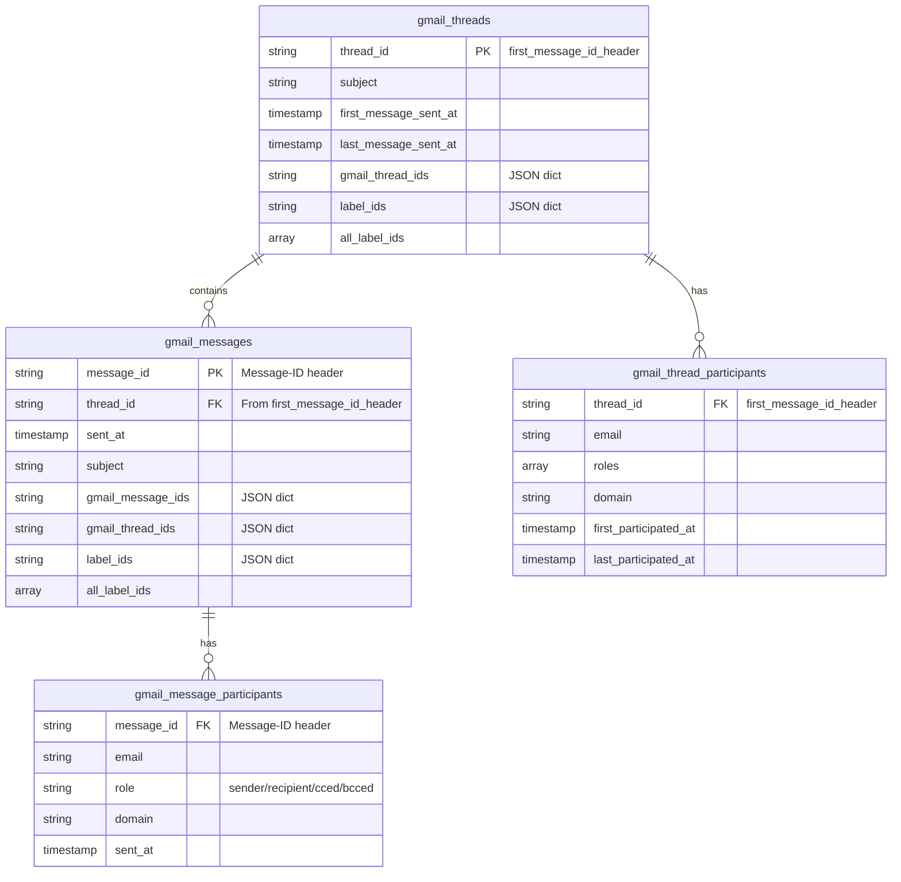

# Gmail Template Source

The **Gmail Template Source** provides instant integration with Gmail data
through the Nango ETL pipeline. It processes email messages into events,
extracts entity identifiers for both people and groups, and creates relationship
declarations - all through simple configuration.

## Overview

The Gmail template source transforms raw Gmail message data into the nexus
framework using a split architecture that handles per-account normalization and
cross-account aggregation:

- **📧 Email Events**: Each message becomes a `message_sent` event; each thread
  becomes a `thread started` event
- **👤 Person Entities**: Extracts email addresses from senders and recipients
- **🏢 Group Entities**: Creates groups from non-generic email domains
- **🔗 Relationships**: Links people to their organizations via email domains
  (membership type)
- **🔄 Cross-Account Deduplication**: Uses `Message-ID` header
  (`message_id_header`) to deduplicate emails across multiple Gmail accounts
- **🧵 Thread Grouping**: Uses `first_message_id_header` to group messages into
  threads across accounts
- **📨 Participant Roles**: Distinguishes between `sender`, `recipient`, `cced`,
  and `bcced` participants
- **🔑 Account Mapping**: Maintains dictionaries mapping accounts to
  Gmail-specific IDs (`gmail_message_ids`, `gmail_thread_ids`)

## Quick Start

### 1. Enable the Template Source

```yaml
# dbt_project.yml
vars:
  nexus:
    gmail:
      enabled: true
```

### 2. Run the Models

```bash
dbt run --select package:nexus
```

### 3. Explore Your Data

```sql
-- View recent Gmail events
SELECT * FROM {{ ref('nexus_events') }}
WHERE source = 'gmail'
ORDER BY occurred_at DESC
LIMIT 10;

-- See email participants with entity information
SELECT
    ev.event_description as subject,
    ev.occurred_at,
    e.name,
    e.email,
    ei.role
FROM {{ ref('nexus_events') }} ev
JOIN {{ ref('nexus_entity_identifiers') }} ei ON ev.event_id = ei.event_id
JOIN {{ ref('nexus_entities') }} e ON ei.identifier_value = e.email
WHERE ev.source = 'gmail'
  AND e.entity_type = 'person'
ORDER BY ev.occurred_at DESC
LIMIT 20;
```

## Configuration

### Basic Configuration

```yaml
# dbt_project.yml
vars:
  nexus:
    gmail:
      enabled: true
      # Uses defaults: schema=gmail, table=messages
```

### Custom Source Location

```yaml
vars:
  nexus:
    gmail:
      enabled: true
      location:
        schema: my_email_data
        table: gmail_messages
```

### Required Global Variables

```yaml
vars:
  # Required: Define internal email domains
  internal_domains:
    - "yourcompany.com"
    - "subsidiary.com"

  # Optional: Test email addresses
  test_emails:
    - "test@yourcompany.com"
```

## Data Requirements

### Source Table Schema

Your Gmail source table must use the **STANDARD_TABLE_SCHEMA** structure:

```sql
CREATE TABLE `project.schema.table` (
  _raw_record JSON NOT NULL,           -- Gmail message as JSON
  _ingested_at TIMESTAMP NOT NULL,      -- When the record was ingested
  _connection_id STRING NOT NULL,       -- Nango connection ID
  _stream_id STRING NOT NULL,           -- Stream identifier (e.g., 'default')
  _sync_timestamp TIMESTAMP,           -- Timestamp-based cursor for incremental sync
  _sync_token STRING                    -- Token-based cursor (history ID)
);
```

### Gmail Message JSON Structure

The `_raw_record` column should contain Gmail API message format:

```json
{
  "id": "message_id_123",
  "threadId": "thread_id_456",
  "internalDate": "1609459200000",
  "headers": [
    {
      "name": "Message-ID",
      "value": "<message-id-abc123@mail.gmail.com>"
    },
    {
      "name": "Subject",
      "value": "Meeting Follow-up"
    },
    {
      "name": "From",
      "value": "John Doe <john@company.com>"
    },
    {
      "name": "To",
      "value": "jane@client.com, bob@partner.com"
    },
    {
      "name": "Cc",
      "value": "team@company.com"
    },
    {
      "name": "Bcc",
      "value": "archive@company.com"
    }
  ],
  "body_text": "Thanks for the great meeting..."
}
```

**Key Fields:**

- `id`: Gmail-specific message ID (unique within a single account)
- `threadId`: Thread identifier
- `internalDate`: Unix timestamp in milliseconds
- `headers`: Array of header objects (must include `Message-ID` for
  deduplication)
- `body_text`: Plain text body content

## Generated Models

Gmail uses a **split architecture** with per-account and cross-account layers
for optimal performance and cross-account deduplication:

### Layer 1: Base - `gmail_messages_base_dedupped.sql`

Simple passthrough with basic deduplication:

**Key Features:**

- Direct `SELECT *` from source table with deduplication
- Minimal transformation overhead
- Uses `QUALIFY` to keep latest record per Gmail message ID per account

### Layer 2: Normalized - Split Architecture

The normalized layer is split into two tiers:

#### Data Model Relationships



#### Per-Account Models (`gmail_normalized_by_account/`)

These models normalize data using Gmail-specific IDs (per account):

- **`gmail_messages_by_account.sql`**: Per-account message normalization

  - Uses `gmail_message_id` (from `$.id`) as primary key
  - Extracts `message_id_header` (Message-ID header) for cross-account linking
  - Extracts `gmail_thread_id` (from `$.threadId`)
  - Extracts subject, labels, snippet, size_estimate
  - Cleans subject by removing RE:/FWD: prefixes
  - Decodes HTML entities in snippet

- **`gmail_threads_by_account.sql`**: Per-account thread aggregation

  - Groups messages by `gmail_thread_id` and `_account`
  - Aggregates thread metadata (subject, timestamps, message counts)
  - Creates `first_message_id_header` for cross-account thread linking
  - Aggregates `label_ids` from all messages in thread

- **`gmail_message_participants_by_account.sql`**: Per-account participant
  extraction

  - One row per participant per message per account
  - Uses `gmail_message_id` for linking
  - Extracts and normalizes email addresses from headers

- **`gmail_thread_participants_by_account.sql`**: Per-account thread participant
  aggregation
  - Groups participants by `gmail_thread_id` and `_account`
  - Aggregates roles and participation timestamps

#### Cross-Account Models

These models aggregate per-account data using cross-account identifiers:

- **`gmail_messages.sql`**: Cross-account message aggregation
  - Groups by `message_id_header` (Message-ID header)
  - Creates dictionaries mapping `_stream_id` to `gmail_message_id` and
    `gmail_thread_id`
  - Aggregates `label_ids` per account and creates `all_label_ids` array
  - Joins with threads to get `thread_id` from `first_message_id_header`
  - Keeps latest values using `ARRAY_AGG` with `ORDER BY sent_at DESC`

**Key Fields:**

```sql
message_id               -- Primary key from message_id_header (Message-ID)
thread_id                -- Thread ID from first_message_id_header
sent_at                  -- Latest sent_at timestamp
subject                  -- Cleaned subject (latest)
raw_subject              -- Original subject (latest)
in_reply_to              -- In-Reply-To header (latest)
snippet                  -- Message snippet (HTML decoded)
size_estimate            -- Message size estimate
gmail_message_ids        -- JSON dict: {"account": "gmail_message_id"}
gmail_thread_ids         -- JSON dict: {"account": "gmail_thread_id"}
label_ids                -- JSON dict: {"account": ["label1", "label2"]}
all_label_ids           -- Array of all unique labels across accounts
raw_record               -- Full JSON record (latest)
source                   -- "gmail"
_ingested_at             -- Latest ingestion timestamp
```

- **`gmail_threads.sql`**: Cross-account thread aggregation
  - Groups by `first_message_id_header` (from per-account threads)
  - Creates `gmail_thread_ids` dictionary mapping accounts to Gmail thread IDs
  - Aggregates `label_ids` per account and creates `all_label_ids` array
  - Aggregates thread metadata (subject, timestamps)

**Key Fields:**

```sql
thread_id                -- Primary key from first_message_id_header
subject                  -- Thread subject (from first message)
raw_subject              -- Original subject (from first message)
first_message_sent_at    -- Earliest message timestamp
last_message_sent_at     -- Latest message timestamp
gmail_thread_ids         -- JSON dict: {"account": "gmail_thread_id"}
label_ids                -- JSON dict: {"account": ["label1", "label2"]}
all_label_ids           -- Array of all unique labels across accounts
_ingested_at             -- Earliest ingestion timestamp
```

- **`gmail_message_participants.sql`**: Cross-account participant aggregation

  - Groups by `message_id_header`, `email`, and `role`
  - Joins with `gmail_messages_by_account` to get `message_id_header`
  - Keeps latest participant information per message

- **`gmail_thread_participants.sql`**: Cross-account thread participant
  aggregation
  - Groups by `thread_id` (from `first_message_id_header`), `email`, and
    `domain`
  - Aggregates roles and participation timestamps across accounts

### Layer 3: Intermediate - Events and Identifiers

- **`gmail_message_events.sql`**: Message events with full metadata

  - Creates `message sent` events from `gmail_messages`
  - Includes all message fields (gmail_message_ids, gmail_thread_ids, labels,
    snippet, etc.)

- **`gmail_thread_events.sql`**: Thread started events

  - Creates `thread started` events from `gmail_threads`
  - Uses `first_message_sent_at` as `occurred_at`

- **`gmail_message_person_identifiers.sql`**: Person identifiers from message
  participants
- **`gmail_message_group_identifiers.sql`**: Group (domain) identifiers from
  message participants
- **`gmail_thread_person_identifiers.sql`**: Person identifiers from thread
  participants
- **`gmail_thread_group_identifiers.sql`**: Group (domain) identifiers from
  thread participants

**Key Pattern:** Event models read from normalized cross-account models.
Identifier models read from participant models and create identifiers linked to
events via `event_id`.

### Layer 4: Union - Nexus Integration

These models feed directly into the nexus pipeline:

#### `gmail_events`

Unified events from messages and threads:

```sql
event_id               -- Unique event identifier (evt_ prefix)
event_name             -- "message sent" or "thread started"
occurred_at            -- Email send time (sent_at) or thread start (first_message_sent_at)
event_description      -- Email subject or thread subject
event_type             -- "email"
source                 -- "gmail"
source_table           -- "gmail_message_events" or "gmail_thread_events"
_ingested_at           -- Ingestion timestamp
-- Additional fields from messages/threads
message_id             -- Message-ID header (for message events)
thread_id              -- Thread identifier
gmail_message_ids      -- Account mapping dictionary
gmail_thread_ids       -- Account mapping dictionary
label_ids              -- Account label mapping
all_label_ids         -- All unique labels
```

#### `gmail_entity_identifiers`

Unified person + group identifiers from messages and threads:

```sql
entity_identifier_id   -- Unique identifier (ent_idfr_ prefix)
event_id               -- Reference to email/thread event
edge_id                -- Groups related identifiers
entity_type            -- "person" or "group"
identifier_type        -- "email" or "domain"
identifier_value       -- Email address or domain
role                   -- Participation role
occurred_at            -- Email/thread timestamp
source                 -- "gmail"
_ingested_at           -- Ingestion timestamp
```

**Role Types:**

- Person roles: `sender`, `recipient`, `cced`, `bcced`
- Group roles: `sender`, `recipient`, `cced`, `bcced` (for domain tracking)

**Note:** Traits and relationship declarations are not generated for Gmail (as
per user requirements).

**Filtered Generic Domains:**

- gmail.com, yahoo.com, hotmail.com, outlook.com
- aol.com, icloud.com, me.com, live.com, msn.com
- googlemail.com, ymail.com, rocketmail.com, protonmail.com
- mail.com, zoho.com

## Cross-Account Architecture

Gmail uses a **split architecture** to handle cross-account deduplication and
aggregation:

### Per-Account Normalization

First, data is normalized per account using Gmail-specific IDs:

- **`gmail_messages_by_account`**: Uses `gmail_message_id` (from `$.id`) as
  primary key
- **`gmail_threads_by_account`**: Uses `gmail_thread_id` (from `$.threadId`) as
  primary key
- Extracts `message_id_header` (Message-ID header) for cross-account linking
- Extracts `first_message_id_header` from threads for cross-account thread
  grouping

### Cross-Account Aggregation

Then, data is aggregated across accounts using standard email identifiers:

- **Messages**: Grouped by `message_id_header` (Message-ID header)
- **Threads**: Grouped by `first_message_id_header` (from the first message in
  thread)
- **Participants**: Grouped by `message_id_header`, `email`, and `role`

### Message-ID Header for Deduplication

- **Primary Key**: `message_id_header` (Message-ID header value) for messages
- **Deduplication**: Messages with the same `Message-ID` across different Gmail
  accounts are treated as the same email
- **Use Case**: Same email appearing in sender's and all recipients' inboxes

### Thread Grouping

- **Thread Key**: `first_message_id_header` (Message-ID of the first message in
  thread)
- **Grouping**: All messages in a thread share the same
  `first_message_id_header`
- **Cross-Account**: Threads are linked across accounts using this identifier

### Account Mapping Dictionaries

The cross-account models maintain dictionaries to map accounts to Gmail-specific
IDs:

- **`gmail_message_ids`**:
  `{"account1@example.com": "gmail_id_1", "account2@example.com": "gmail_id_2"}`
- **`gmail_thread_ids`**:
  `{"account1@example.com": "thread_id_1", "account2@example.com": "thread_id_2"}`
- **`label_ids`**:
  `{"account1@example.com": ["INBOX", "SENT"], "account2@example.com": ["INBOX"]}`

This allows you to:

- Track which Gmail account a message/thread belongs to
- Access account-specific labels
- Link back to per-account data when needed

### Why Message-ID Instead of Gmail ID?

Gmail message IDs (`$.id`) are account-specific. The same email has different
IDs when it appears in:

- Sender's Sent folder
- Recipient's Inbox
- CC recipient's Inbox

`Message-ID` is standardized by RFC 2822 and is consistent across all accounts,
making it the perfect deduplication key for cross-account aggregation.

## Integration Examples

### Customer Communication Timeline

```sql
-- View all email communication with a specific customer
WITH customer AS (
    SELECT entity_id, email, name
    FROM {{ ref('nexus_entities') }}
    WHERE email = 'customer@client.com'
      AND entity_type = 'person'
)

SELECT
    e.occurred_at,
    e.event_description as subject,
    sender.email as from_email,
    sender.name as from_name,
    customer.email as customer_email,
    ei.role as customer_role
FROM {{ ref('nexus_events') }} e
JOIN {{ ref('nexus_entity_identifiers') }} ei ON e.event_id = ei.event_id
JOIN customer ON ei.identifier_value = customer.email
LEFT JOIN {{ ref('nexus_entities') }} sender
    ON sender.entity_type = 'person'
    AND EXISTS (
        SELECT 1 FROM {{ ref('nexus_entity_identifiers') }} ei2
        WHERE ei2.event_id = e.event_id
          AND ei2.identifier_value = sender.email
          AND ei2.role = 'sender'
    )
WHERE e.source = 'gmail'
ORDER BY e.occurred_at DESC;
```

### Email Domain Analysis

```sql
-- Analyze email communication by domain with relationship data
SELECT
    g.name as domain,
    COUNT(DISTINCT e.event_id) as email_count,
    COUNT(DISTINCT p.entity_id) as unique_people,
    COUNT(DISTINCT CASE WHEN ei.role = 'sender' THEN p.entity_id END) as senders,
    COUNT(DISTINCT CASE WHEN ei.role = 'recipient' THEN p.entity_id END) as recipients,
    MIN(e.occurred_at) as first_contact,
    MAX(e.occurred_at) as last_contact
FROM {{ ref('nexus_events') }} e
JOIN {{ ref('nexus_entity_identifiers') }} gei
    ON e.event_id = gei.event_id
    AND gei.entity_type = 'group'
JOIN {{ ref('nexus_entities') }} g
    ON gei.identifier_value = g.domain
    AND g.entity_type = 'group'
JOIN {{ ref('nexus_relationships') }} r
    ON r.entity_b_id = g.entity_id
JOIN {{ ref('nexus_entities') }} p
    ON r.entity_a_id = p.entity_id
    AND p.entity_type = 'person'
JOIN {{ ref('nexus_entity_identifiers') }} ei
    ON ei.event_id = e.event_id
    AND ei.identifier_value = p.email
WHERE e.source = 'gmail'
GROUP BY g.entity_id, g.name
ORDER BY email_count DESC;
```

### Participant Role Analysis

```sql
-- Analyze email participation patterns by role
SELECT
    role,
    COUNT(DISTINCT message_id) as message_count,
    COUNT(DISTINCT email) as unique_participants,
    COUNT(*) as total_participations
FROM {{ ref('gmail_message_participants') }}
WHERE sent_at >= CURRENT_DATE - INTERVAL 30 DAY
GROUP BY role
ORDER BY total_participations DESC;
```

### Thread Conversation Analysis

```sql
-- Analyze email threads with participant counts
SELECT
    t.thread_id,
    t.subject,
    t.first_message_sent_at,
    t.last_message_sent_at,
    COUNT(DISTINCT m.message_id) as message_count,
    COUNT(DISTINCT tp.email) as unique_participants,
    t.gmail_thread_ids
FROM {{ ref('gmail_threads') }} t
LEFT JOIN {{ ref('gmail_messages') }} m ON t.thread_id = m.thread_id
LEFT JOIN {{ ref('gmail_thread_participants') }} tp ON t.thread_id = tp.thread_id
WHERE t.first_message_sent_at >= CURRENT_DATE - INTERVAL 90 DAY
GROUP BY t.thread_id, t.subject, t.first_message_sent_at, t.last_message_sent_at, t.gmail_thread_ids
HAVING message_count > 1
ORDER BY t.first_message_sent_at DESC;
```

### Cross-Account Message Tracking

```sql
-- Find messages that appear in multiple accounts
SELECT
    message_id,
    subject,
    sent_at,
    JSON_EXTRACT_SCALAR(gmail_message_ids, '$.account1@example.com') as account1_gmail_id,
    JSON_EXTRACT_SCALAR(gmail_message_ids, '$.account2@example.com') as account2_gmail_id,
    all_label_ids
FROM {{ ref('gmail_messages') }}
WHERE JSON_EXTRACT(gmail_message_ids, '$') IS NOT NULL
  AND ARRAY_LENGTH(JSON_EXTRACT_ARRAY(JSON_OBJECT_KEYS(gmail_message_ids))) > 1
ORDER BY sent_at DESC;
```

## Performance Considerations

### Incremental Processing

For large Gmail datasets:

```yaml
# dbt_project.yml
models:
  nexus:
    sources:
      gmail:
        +materialized: incremental
        +unique_key: message_id
        +cluster_by: ["sent_at"]
```

### Partitioning (BigQuery)

Optimize time-based queries:

```yaml
models:
  nexus:
    sources:
      gmail:
        +partition_by:
          { "field": "sent_at", "data_type": "timestamp", "granularity": "day" }
```

## Troubleshooting

### Common Issues

**1. No Gmail events appearing**

- Check `nexus.gmail.enabled: true` is set
- Verify source table exists with STANDARD_TABLE_SCHEMA structure
- Ensure `Message-ID` header is present in raw JSON records
- Verify source data has the expected JSON structure

**2. Missing email participants**

- Check that `From`, `To`, `Cc`, `Bcc` headers are not null/empty in source data
- Verify email parsing macros are working correctly
- Ensure participant normalization is enabled

**3. Generic domains appearing as groups**

- Review the generic domain filter list
- Add additional generic domains if needed
- Verify `filter_non_generic_domains()` macro is working

**4. Duplicate emails across accounts**

- Verify `Message-ID` header is being extracted correctly
- Check that deduplication QUALIFY clause is working
- Ensure all messages have valid `Message-ID` headers

### Debugging Queries

```sql
-- Check raw source data
SELECT
    _raw_record,
    _ingested_at,
    _connection_id,
    _stream_id
FROM {{ source('gmail', 'messages') }}
LIMIT 5;

-- Verify base model processing
SELECT * FROM {{ ref('gmail_messages_base') }}
LIMIT 10;

-- Check normalized messages with deduplication
SELECT
    message_id,
    gmail_message_id,
    subject,
    sent_at,
    thread_id
FROM {{ ref('gmail_messages') }}
ORDER BY sent_at DESC
LIMIT 10;

-- Verify participants extraction
SELECT
    message_id,
    email,
    role,
    domain
FROM {{ ref('gmail_message_participants') }}
LIMIT 20;

-- Check Message-ID extraction
SELECT
    message_id,
    gmail_message_id,
    message_id_header,
    COUNT(*) as count
FROM {{ ref('gmail_messages') }}
GROUP BY message_id, gmail_message_id, message_id_header
HAVING count > 1;
```

## Advanced Configuration

### Custom Email Filtering

Filter specific messages or domains:

```sql
-- Filter to external emails only
SELECT * FROM {{ ref('gmail_messages') }} m
WHERE EXISTS (
    SELECT 1 FROM {{ ref('gmail_message_participants') }} p
    WHERE p.message_id = m.message_id
      AND p.domain NOT IN ('yourcompany.com')
);
```

### Header Extraction

Add custom header extraction:

```sql
-- Extract custom headers in normalized model
(SELECT JSON_EXTRACT_SCALAR(header, '$.value')
 FROM UNNEST(JSON_EXTRACT_ARRAY(_raw_record, '$.headers')) as header
 WHERE LOWER(JSON_EXTRACT_SCALAR(header, '$.name')) = 'custom-header'
 LIMIT 1) as custom_header_value
```

## Migration Guide

### From Custom Gmail Models

If you have existing custom Gmail models:

1. **Backup Current Models**: Save your existing logic
2. **Compare Schemas**: Ensure data compatibility with STANDARD_TABLE_SCHEMA
3. **Verify Message-ID**: Ensure your source data includes `Message-ID` in
   headers
4. **Enable Template Source**: Configure to point to your data
5. **Test Output**: Verify data quality, deduplication, and completeness
6. **Update References**: Change refs to use template models
7. **Remove Custom Models**: Clean up old source models

### Schema Compatibility

Ensure your Gmail data includes:

- Message `id` and `threadId`
- `internalDate` for timestamp
- `headers` array with at least `Message-ID`, `From`, `To` headers
- `body_text` for email content
- Optional: `Cc`, `Bcc` headers for participant extraction

### STANDARD_TABLE_SCHEMA Migration

If migrating from old schema with `record` and `synced_at`:

```sql
-- Example migration query
CREATE OR REPLACE TABLE `new_table` AS
SELECT
    old_record as _raw_record,
    synced_at as _ingested_at,
    'connection_123' as _connection_id,
    'default' as _stream_id,
    synced_at as _sync_timestamp,
    NULL as _sync_token
FROM `old_table`;
```

### Handling Missing Message-ID

If some messages lack `Message-ID` headers:

```sql
-- Option 1: Use Gmail ID as fallback
COALESCE(
    message_id_header,
    CONCAT('gmail_', gmail_message_id)
) as message_id

-- Option 2: Filter out messages without Message-ID
WHERE message_id_header IS NOT NULL
```

---

**Ready to integrate Gmail?** Set `nexus.gmail.enabled: true` and run
`dbt build`!
