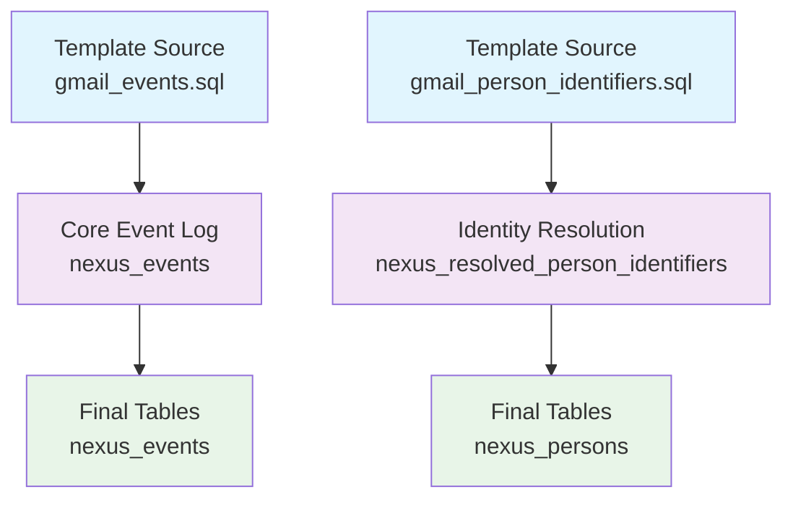

# Template Sources

Template Sources are **ready-to-use source integrations** built into the
dbt-nexus package. These pre-built source models handle common data sources like
Gmail, Google Calendar, Stripe, and more, providing instant integration with the
nexus framework through simple configuration.

**Note**: Current template sources depend on the Nexus ETL pipeline (`app/`) for
data syncing via Nango integrations. The ETL pipeline handles authentication,
data extraction, and loading into BigQuery before dbt processing begins.

## What are Template Sources?

Template Sources eliminate the need to write boilerplate source adapter models
by providing:

- **🎯 Pre-built Logic**: Complete source processing for common platforms
- **⚙️ Simple Configuration**: Enable with a single variable
- **📍 Flexible Locations**: Override default source locations per environment
- **🔧 Zero Maintenance**: Updates come with package updates
- **🚀 Instant Integration**: Full nexus pipeline integration out of the box

## Available Template Sources

| Source                              | Status         | Events | Persons | Groups | Memberships |
| ----------------------------------- | -------------- | ------ | ------- | ------ | ----------- |
| [Gmail](gmail/)                     | ✅ Ready       | ✅     | ✅      | ✅     | ✅          |
| [Google Calendar](google_calendar/) | ✅ Ready       | ✅     | ✅      | ✅     | ✅          |
| Stripe                              | 🚧 Coming Soon | ✅     | ✅      | ✅     | ❌          |
| Shopify                             | 🚧 Coming Soon | ✅     | ❌      | ✅     | ❌          |

## Prerequisites

### ETL Pipeline Dependency

Template sources require the Nexus ETL pipeline for data ingestion:

- **📡 Data Sync**: The `app/` directory contains a Convex-based ETL pipeline
- **🔑 Authentication**: Handles OAuth and API authentication for each source
- **🔄 Nango Integration**: Uses Nango for standardized API connections
- **💾 BigQuery Loading**: Syncs data to BigQuery in the expected JSON format
- **⏱️ Scheduling**: Manages incremental syncing and real-time updates

**ETL → dbt Flow:**

```
Source APIs → Nango → app/ ETL → BigQuery → dbt-nexus → Final Tables
```

### Data Requirements

Each template source expects:

- **Raw JSON data** synced by the ETL pipeline
- **Standardized schema** with `record` and `synced_at` columns
- **Proper authentication** configured in the ETL pipeline
- **Active sync schedules** for data freshness

## How Template Sources Work

### 1. **Built into dbt-nexus Package**

Template sources live in `dbt-nexus/models/sources/` and are disabled by
default:

```
dbt-nexus/models/sources/
├── gmail/
│   ├── base/
│   │   └── gmail_messages_base.sql
│   ├── gmail_events.sql
│   ├── gmail_person_identifiers.sql
│   ├── gmail_person_traits.sql
│   ├── gmail_group_identifiers.sql
│   ├── gmail_group_traits.sql
│   ├── gmail_membership_identifiers.sql
│   └── gmail.yml
└── google_calendar/
    ├── base/
    │   └── google_calendar_events_base.sql
    ├── google_calendar_events.sql
    ├── google_calendar_person_identifiers.sql
    ├── google_calendar_person_traits.sql
    ├── google_calendar_group_identifiers.sql
    ├── google_calendar_group_traits.sql
    ├── google_calendar_membership_identifiers.sql
    └── google_calendar.yml
```

### 2. **Conditional Compilation**

Each template source uses the `enabled` config to control compilation:

```sql
{{ config(
    enabled=var('nexus', {}).get('gmail', {}).get('enabled', false),
    materialized='table',
    tags=['event-processing', 'realtime']
) }}
```

### 3. **Configurable Source Locations**

Source definitions use variables for flexible data location:

```yaml
# gmail.yml
sources:
  - name:
      "{{ var('nexus', {}).get('gmail', {}).get('location', {}).get('schema',
      'gmail') }}"
    tables:
      - name:
          "{{ var('nexus', {}).get('gmail', {}).get('location', {}).get('table',
          'messages') }}"
```

## Basic Configuration

### Enable a Template Source

```yaml
# dbt_project.yml
vars:
  nexus:
    gmail:
      enabled: true
    google_calendar:
      enabled: true
```

### Override Source Locations

```yaml
# dbt_project.yml
vars:
  nexus:
    gmail:
      enabled: true
      location:
        schema: my_email_data
        table: gmail_messages
    google_calendar:
      enabled: true
      location:
        schema: my_calendar_data
        table: calendar_events
```

## Advanced Configuration

### Environment-Specific Setup

**Development:**

```yaml
# profiles.yml or dbt_project.yml
vars:
  nexus:
    gmail:
      enabled: true
      location:
        schema: gmail_dev
        table: messages_sample
```

**Production:**

```yaml
vars:
  nexus:
    gmail:
      enabled: true
      location:
        schema: gmail_prod
        table: messages_full
```

### Multi-Project Setup

**Project A (Full Sources):**

```yaml
vars:
  nexus:
    gmail:
      enabled: true
    google_calendar:
      enabled: true
```

**Project B (Gmail Only):**

```yaml
vars:
  nexus:
    gmail:
      enabled: true
    google_calendar:
      enabled: false
```

## Integration with Nexus Pipeline

When enabled, template sources automatically integrate with the nexus pipeline:



## Required Variables

Most template sources require these global variables:

```yaml
# dbt_project.yml
vars:
  # Required: Define your company's email domains
  internal_domains:
    - "yourcompany.com"
    - "subsidiary.com"

  # Optional: Test email addresses for filtering
  test_emails:
    - "test@yourcompany.com"
```

## Usage Examples

### Query Template Source Data

```sql
-- View Gmail events
SELECT * FROM {{ ref('gmail_events') }}
WHERE occurred_at >= current_date - interval 7 days;

-- View Calendar meetings
SELECT * FROM {{ ref('google_calendar_events') }}
WHERE event_name = 'external_meeting'
ORDER BY occurred_at DESC;
```

### Build Custom Models

```sql
-- models/analytics/communication_summary.sql
SELECT
    p.name,
    p.email,
    COUNT(CASE WHEN e.source = 'gmail' THEN 1 END) as email_count,
    COUNT(CASE WHEN e.source = 'google_calendar' THEN 1 END) as meeting_count
FROM {{ ref('persons') }} p
JOIN {{ ref('person_participants') }} pp ON p.id = pp.person_id
JOIN {{ ref('events') }} e ON pp.event_id = e.id
WHERE e.occurred_at >= current_date - interval 30 days
GROUP BY p.name, p.email
```

## Benefits

### For Data Teams

- **⚡ Instant Setup**: Enable sources in seconds, not hours
- **🔧 Zero Maintenance**: Updates come with package releases
- **📊 Consistent Processing**: Standardized data transformations
- **🎯 Best Practices**: Built-in data quality and deduplication

### For Organizations

- **🚀 Faster Time-to-Value**: Get insights from new sources immediately
- **💰 Reduced Development Cost**: No custom source adapter development
- **🔄 Reusable Across Projects**: Same logic works everywhere
- **📈 Scalable Architecture**: Add new sources without rebuilding

## Troubleshooting

### Common Issues

**1. Source Not Found**

```
Error: Relation 'gmail.messages' not found
```

**Solution**: Verify your source data exists and location configuration is
correct

**2. Missing Columns**

```
Error: Column 'synced_at' not found
```

**Solution**: Check that your source data has the expected schema structure

**3. Models Not Building**

```
Error: No columns found to union
```

**Solution**: Ensure at least one source is enabled and has data

### Validation Commands

```bash
# Check which sources are enabled
dbt list --select package:nexus --output name | grep -E "(gmail|google_calendar)"

# Test source configuration
dbt compile --select gmail_messages_base

# Run specific template source
dbt run --select gmail_events
```

## Migration from Custom Sources

If you have existing custom source models, you can migrate to template sources:

### 1. **Compare Schemas**

Ensure your existing data matches the template source expectations

### 2. **Enable Template Source**

Configure the template source to point to your data

### 3. **Test Integration**

Run the template source and verify data quality

### 4. **Remove Custom Models**

Delete your custom source models once template sources are working

### 5. **Update Dependencies**

Update any models that referenced your custom sources

## Next Steps

- **[Gmail Template Source](gmail/)** - Complete Gmail integration guide
- **[Google Calendar Template Source](google_calendar/)** - Complete Calendar
  integration guide
- **[Creating Custom Sources](../how-to/custom-sources.md)** - Build your own
  source adapters
- **[Source Configuration Reference](../reference/configuration.md)** - Complete
  configuration options

---

**Ready to get started?** Choose a template source from the list above and
follow the specific integration guide!
