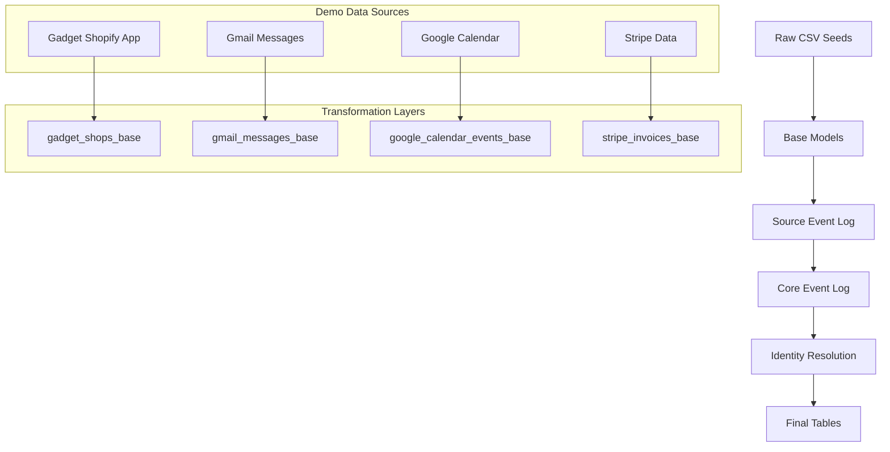

# Demo Data

The dbt-nexus package includes comprehensive demo data that demonstrates all the
package's capabilities with realistic, multi-source scenarios. This demo data
includes events, persons, groups, and memberships from multiple data sources
like Shopify, Gmail, Google Calendar, and Stripe.

## Quick Start

### 1. Build Demo Data from Main Project

The demo data builds automatically when you run `dbt build` from your main
project directory because the nexus package includes its own default demo data
configuration.

```bash
# From your main project directory (e.g., slide-rule-tech/slide_rule_tech/)
dbt build
```

This will create all the demo data models using the package's default schema
configuration.

### 2. Alternative: Build from Package Directory

You can also build the demo data directly from the package directory:

```bash
# Navigate to the nexus package directory
cd dbt_packages/nexus

# Run the demo data models
dbt build
```

**Note**: The demo data builds automatically because the nexus package has its
own `vars` configuration in its `dbt_project.yml` that defines the demo sources.
If you want to override this with your own data sources, you would add your own
`vars` section to your main project's `dbt_project.yml`.

## Schema Organization

The demo data uses a structured schema approach with multiple schemas for
different layers of the transformation pipeline:

- **`demo_raw`** - Raw seed data (CSV files)
- **`sources_demo`** - Source event log models (transformed from raw data)
- **`event_log_demo`** - Core event log models (unified across sources)
- **`identity_resolution_demo`** - Identity resolution models (resolved
  entities)
- **`final_tables_demo`** - Final unified tables (persons, groups, events,
  states)

This organization separates different layers of the data transformation pipeline
into distinct schemas for better organization and clarity.

## Demo Data Structure

### Raw Data Sources

The demo data includes realistic seed data from four main sources:

#### 1. Gadget Shopify App Data (`shopify_shops_raw_demo.csv`)

- **Structure**: JSON records containing Shopify shop information from our
  custom Shopify app built in Gadget
- **Content**: Shop details, owner information, plan details, webhook
  configurations, app installation data
- **Example**: Hollywood Farms shop with Shopify Plus plan, owner Lewis Smith,
  app installation status

#### 2. Gmail Messages (`gmail_messages_raw_demo.csv`)

- **Structure**: Email records with sender, recipient, subject, body, and
  metadata
- **Content**: Support tickets, billing communications, welcome emails
- **Example**: Bug reports, payment reminders, onboarding communications

#### 3. Google Calendar Events (`google_calendar_events_raw_demo.csv`)

- **Structure**: Calendar event records with attendees, timing, and details
- **Content**: Meetings, appointments, recurring events
- **Example**: Customer support calls, product demos, team meetings

#### 4. Stripe Data (`stripe_invoices_raw_demo.csv`, `stripe_payments_raw_demo.csv`)

- **Structure**: Billing and payment records with customer and transaction
  details
- **Content**: Invoices, payments, subscription events
- **Example**: Monthly subscriptions, one-time payments, failed charges

### Data Transformation Flow

The demo data follows the standard dbt-nexus transformation pipeline:



### Key Demo Scenarios

The demo data creates realistic scenarios including:

1. **Multi-Source Customer Journey**

   - Shopify app installation and shop events (via Gadget)
   - Gmail support interactions
   - Calendar meeting scheduling
   - Stripe subscription management

2. **Identity Resolution**

   - Same person across multiple sources (email matching)
   - Group relationships (shop owners, team members)
   - Membership roles (admin, user, billing contact)

3. **Event Timeline**
   - Chronological event ordering
   - Cross-source event correlation
   - State changes over time

## Exploring the Demo Data

### View Available Models

```bash
dbt ls --models tag:nexus
```

### Run Specific Demo Sources

```bash
# Run only Gmail demo data
dbt run --models tag:nexus --select source:gmail

# Run only Gadget Shopify app demo data
dbt run --models tag:nexus --select source:gadget
```

### Query Demo Data

Once built, you can explore the demo data using the appropriate schema names:

```sql
-- View all demo events (using final_tables_demo schema)
SELECT * FROM final_tables_demo.nexus_events
ORDER BY occurred_at DESC;

-- View resolved persons (using final_tables_demo schema)
SELECT * FROM final_tables_demo.nexus_persons;

-- View group memberships (using final_tables_demo schema)
SELECT
    p.name as person_name,
    g.name as group_name,
    m.role
FROM final_tables_demo.nexus_memberships m
JOIN final_tables_demo.nexus_persons p ON m.person_id = p.id
JOIN final_tables_demo.nexus_groups g ON m.group_id = g.id;

-- View events by source
SELECT
    source,
    COUNT(*) as event_count
FROM final_tables_demo.nexus_events
GROUP BY source;
```

**Note**: If you've customized the schema configuration, replace
`final_tables_demo` with your custom schema name (e.g., `nexus_final_tables`).

## Customizing Demo Data

### Adding New Demo Sources

1. Create new seed files in `seeds/demo-data/`
2. Add base models in `models/demo_data/sources/[source_name]/base/`
3. Create source event log models following the pattern
4. Update the `dbt_project.yml` variables to include the new source

### Modifying Existing Demo Data

Edit the CSV seed files to:

- Add new records
- Modify existing data
- Change timestamps for different scenarios
- Add new fields or properties

## Troubleshooting

### Common Issues

1. **Schema Not Found**: Ensure your consumer project has the correct schema
   configuration
2. **Missing Seeds**: Run `dbt seed` before `dbt build` to populate raw data
3. **Permission Errors**: Verify your database user has CREATE permissions on
   the target schema

### Debugging Demo Data

```bash
# Check seed data
dbt seed --show

# Test specific models
dbt run --models demo_data.sources.gadget.gadget_events

# View compiled SQL
dbt compile --models demo_data.sources.gadget.gadget_events
```

## Next Steps

After exploring the demo data:

1. **Follow the Tutorials**: Use the demo data to work through the
   [Basic Setup](basic-setup.md) tutorial
2. **Explore Identity Resolution**: See how the package resolves entities across
   sources
3. **Understand State Management**: Learn how states are tracked over time
4. **Build Your Own Sources**: Use the demo data as a template for your real
   data sources

The demo data provides a complete, working example of the dbt-nexus package that
you can use to understand the data model, test queries, and develop your own
implementations.
