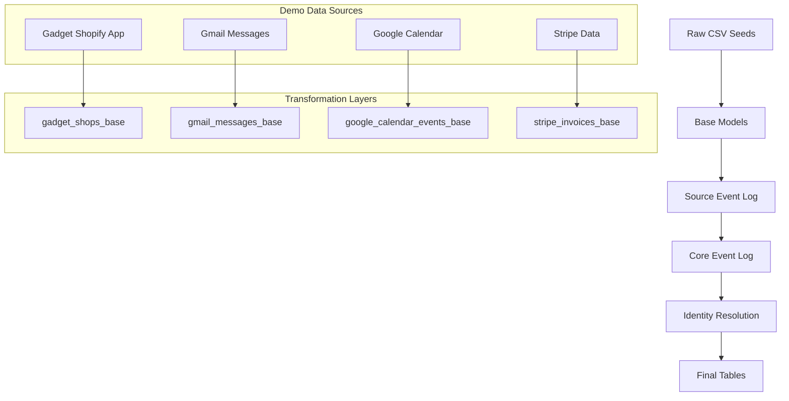

# Demo Data

The dbt-nexus package includes comprehensive demo data that demonstrates all the
package's capabilities with realistic, multi-source scenarios. This demo data
includes events, persons, groups, and memberships from multiple data sources
like Shopify, Gmail, Google Calendar, and Stripe.

## Quick Start

### 1. Navigate to the Nexus Package

From your consumer project, navigate to the dbt-nexus package directory:

```bash
cd dbt_packages/nexus
```

### 2. Build the Demo Data

Run the demo data models:

```bash
dbt build
```

This will create all the demo data models in your target schema.

## Schema Organization

The demo data gets compiled to the `nexus_demo_data` schema in your data
warehouse. This schema contains:

- **Raw demo data tables** (from seeds)
- **Source event log models** (transformed from raw data)
- **Core event log models** (unified across sources)
- **Identity resolution models** (resolved entities)
- **Final tables** (persons, groups, events, memberships)

## Consumer Project Configuration

To enable demo data in your consumer project, add the following configuration to
your `dbt_project.yml`:

```yaml
models:
  nexus:
    +schema: nexus
    demo-data:
      +schema: demo_data
      +tags: ["nexus"]
```

This configuration:

- Places the main nexus models in the `nexus` schema
- Places demo data models in the `demo_data` schema
- Tags demo data models for selective running

## Demo Data Structure

### Raw Data Sources

The demo data includes realistic seed data from four main sources:

#### 1. Gadget Shopify App Data (`shopify_shops_raw_demo.csv`)

- **Structure**: JSON records containing Shopify shop information from our
  custom Shopify app built in Gadget
- **Content**: Shop details, owner information, plan details, webhook
  configurations, app installation data
- **Example**: Hollywood Farms shop with Shopify Plus plan, owner Lewis Smith,
  app installation status

#### 2. Gmail Messages (`gmail_messages_raw_demo.csv`)

- **Structure**: Email records with sender, recipient, subject, body, and
  metadata
- **Content**: Support tickets, billing communications, welcome emails
- **Example**: Bug reports, payment reminders, onboarding communications

#### 3. Google Calendar Events (`google_calendar_events_raw_demo.csv`)

- **Structure**: Calendar event records with attendees, timing, and details
- **Content**: Meetings, appointments, recurring events
- **Example**: Customer support calls, product demos, team meetings

#### 4. Stripe Data (`stripe_invoices_raw_demo.csv`, `stripe_payments_raw_demo.csv`)

- **Structure**: Billing and payment records with customer and transaction
  details
- **Content**: Invoices, payments, subscription events
- **Example**: Monthly subscriptions, one-time payments, failed charges

### Data Transformation Flow

The demo data follows the standard dbt-nexus transformation pipeline:



### Key Demo Scenarios

The demo data creates realistic scenarios including:

1. **Multi-Source Customer Journey**

   - Shopify app installation and shop events (via Gadget)
   - Gmail support interactions
   - Calendar meeting scheduling
   - Stripe subscription management

2. **Identity Resolution**

   - Same person across multiple sources (email matching)
   - Group relationships (shop owners, team members)
   - Membership roles (admin, user, billing contact)

3. **Event Timeline**
   - Chronological event ordering
   - Cross-source event correlation
   - State changes over time

## Exploring the Demo Data

### View Available Models

```bash
dbt ls --models tag:nexus
```

### Run Specific Demo Sources

```bash
# Run only Gmail demo data
dbt run --models tag:nexus --select source:gmail

# Run only Gadget Shopify app demo data
dbt run --models tag:nexus --select source:gadget
```

### Query Demo Data

Once built, you can explore the demo data:

```sql
-- View all demo events
SELECT * FROM nexus_demo_data.events
ORDER BY occurred_at DESC;

-- View resolved persons
SELECT * FROM nexus_demo_data.persons;

-- View group memberships
SELECT
    p.name as person_name,
    g.name as group_name,
    m.role
FROM nexus_demo_data.memberships m
JOIN nexus_demo_data.persons p ON m.person_id = p.id
JOIN nexus_demo_data.groups g ON m.group_id = g.id;
```

## Customizing Demo Data

### Adding New Demo Sources

1. Create new seed files in `seeds/demo-data/`
2. Add base models in `models/demo_data/sources/[source_name]/base/`
3. Create source event log models following the pattern
4. Update the `dbt_project.yml` variables to include the new source

### Modifying Existing Demo Data

Edit the CSV seed files to:

- Add new records
- Modify existing data
- Change timestamps for different scenarios
- Add new fields or properties

## Troubleshooting

### Common Issues

1. **Schema Not Found**: Ensure your consumer project has the correct schema
   configuration
2. **Missing Seeds**: Run `dbt seed` before `dbt build` to populate raw data
3. **Permission Errors**: Verify your database user has CREATE permissions on
   the target schema

### Debugging Demo Data

```bash
# Check seed data
dbt seed --show

# Test specific models
dbt run --models demo_data.sources.gadget.gadget_events

# View compiled SQL
dbt compile --models demo_data.sources.gadget.gadget_events
```

## Next Steps

After exploring the demo data:

1. **Follow the Tutorials**: Use the demo data to work through the
   [Basic Setup](basic-setup.md) tutorial
2. **Explore Identity Resolution**: See how the package resolves entities across
   sources
3. **Understand State Management**: Learn how states are tracked over time
4. **Build Your Own Sources**: Use the demo data as a template for your real
   data sources

The demo data provides a complete, working example of the dbt-nexus package that
you can use to understand the data model, test queries, and develop your own
implementations.
